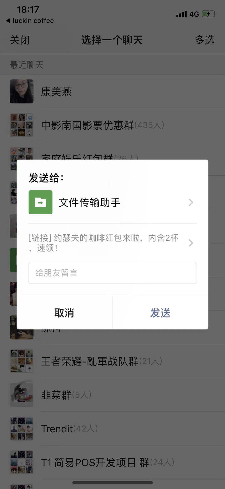
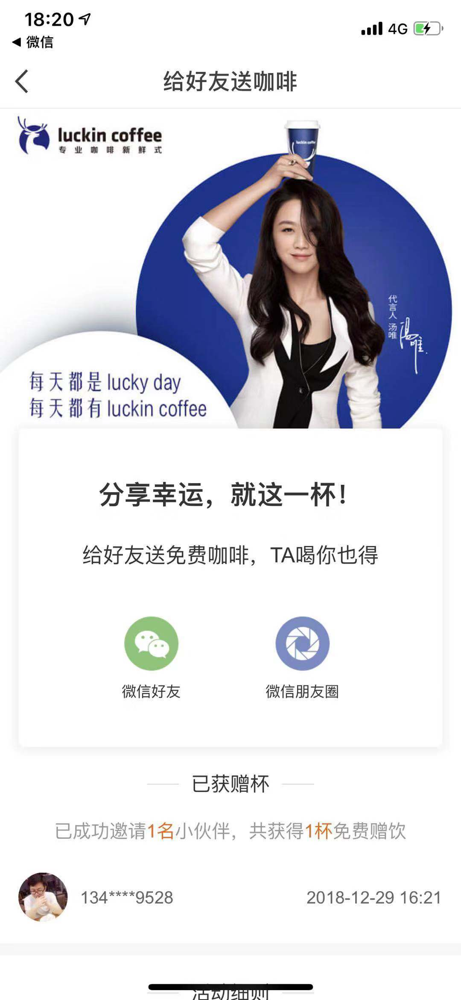

很久之前就知道小蓝咖啡，毕竟其广告已经覆盖到小区的每部电梯，最近试用了一下小蓝咖啡App，有一些理解和总结。本文仅对IOS平台的小蓝咖啡App进行分析，不论及咖啡质量、品牌定位、公司运作等。

App支持手机注册及微信登陆，最终会将手机号与微信号绑定，然后利用微信的好友关系进行用户裂变。

<!--more-->

### 主页介绍

主页包含以下几个标签
- 首页

    - <b>图片Banner</b> 轮播优惠、品牌广告等信息。
    - <b>当前所选实体店</b> 右侧有购买选项，包含自提和外送，点击前者会弹出实体店面列表，后者会让用户选择配送地址。
    - <b>现在下单</b> 跳转到菜单标签。
    - <b>咖啡钱包</b> 跳转到咖啡钱包菜单，后面介绍。
    - <b>送他咖啡</b> 跳转到用户分享页面。
    - <b>企业账户</b> 跳转到企业推广页面。

- 菜单

根据选择的店面，获取菜单列表，切换店面时，菜单会刷新。

- 订单

显示订单列表，包含未完成和已完成的订单。

- 购物车

显示已选购但未下单的产品。

- 我的

显示个人信息，包括地址管理，联系方式，及其等下会介绍的<b>咖啡钱包</b>

### 咖啡钱包

- 咖啡券
这个页面展示已经钱包里有的咖啡券，咖啡券的来源大致有几个

    - 充值购买 现在有一些优惠活动，比如说买二赠一，买五赠五之类。
    - 分享新用户免费获得 这是一种很有诱惑力的用户裂变手段。
    - 好友赠送 包括好友的咖啡红包，和好友直接转赠。

- 我要请客

点击我要请客，将咖啡券以红包形式转增给好友。

用户点击后，可以看到领取详情。

如果是新用户，这里绑定手机号，然后注册后就可以直接使用这张券了。

- 发送红包
于我要请客差不多，也是以红包形式转增也好友。

### 给好友送咖啡


这个页面的url大致为: https://mkt.luckincoffee.com/wechat/author?appid=wxc7d10081104e0956&redirect_uri=https%3A%2F%2Fm.luckincoffee.com%2FwxauthorUseAPI&response_type=code&scope=snsapi_userinfo&state=3dd44586-1364-4193-8f78-13ed1b50a2d1#wechat_redirect

可以看到有appid的参数，根据这个参数，获取该用户的获赠记录，点击微信图标分享的界面如下：


页面的url如下：
https://m.luckincoffee.com/invited/register?type=zhangzhen&activityNo=NR201801030001&inviteCode=V0hwuT7I9Nnbyr3p5tjR7g%3D%3D&secondfrom=1&title=%E4%BB%8A%E5%A4%A9%E5%91%A8%E6%9C%AB%EF%BC%8C%E8%AF%B7%E4%BD%A0%E5%96%9D%E6%9D%AF%E5%85%8D%E8%B4%B9%E5%A4%A7%E5%B8%88%E5%92%96%E5%95%A1%EF%BC%8C%E5%92%96%E5%95%A1%E5%92%8C%E8%BF%90%E5%8A%A8%E5%BE%88%E9%85%8D%E5%93%A6&timestamp=1546085863328&from=singlemessage&isappinstalled=0

可以看到，url里面有一个唯一邀请码，表示属于该用户分享出来的，这样新用户注册以后就可以该用户账户下增加一张咖啡券了。

不得不说，小蓝咖啡利用微信进行用户裂变的方式上做的非常到位，很大的刺激了用户的分享欲望，反正我周围的羊毛党都被我安利了一遍，：）

