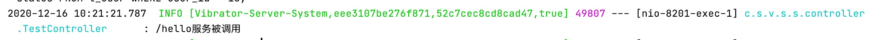
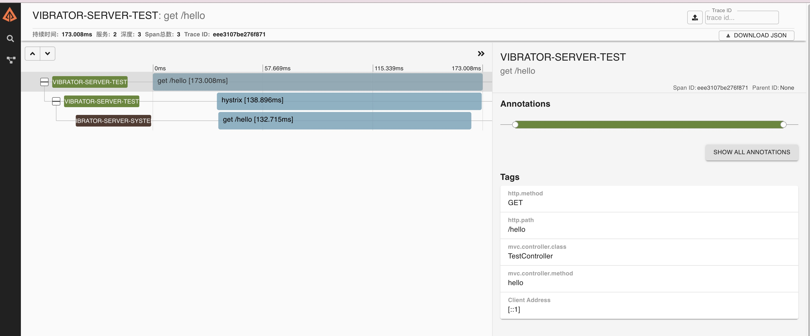
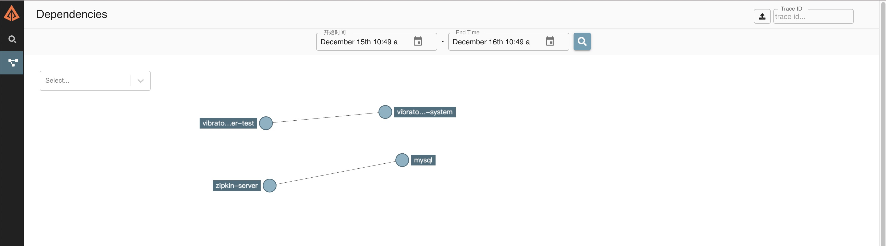

利用sleuth, zipkin，rabbitmq搭建微服务调用链路追踪是一种很流行的方法，最近我用docker搭建了它们，在此记录一下。

其中sleuth是用来创建链路ID，zipkin用来收集存储搜索展示链路信息，rabbitmq消息中间件，zipkin客户端是其生产端，zipkin服务端是其消费端。

<!-- more -->

### 创建docker自定义网络
```bash
docker network create vibrator
```
其中vibrator是网络名。

可以查询到刚创建的网络的详细信息
```
lijundeMacBook-Pro:zipkin-mysql lijunyin$ docker network inspect vibrator;
[
    {
        "Name": "vibrator",
        "Id": "cebe167c49cc7a82abda41eddffcf241956c7b28074c9f0ab8c454d8299248be",
        "Created": "2020-12-15T02:05:53.9179838Z",
        "Scope": "local",
        "Driver": "bridge",
        "EnableIPv6": false,
        "IPAM": {
            "Driver": "default",
            "Options": {},
            "Config": [
                {
                    "Subnet": "172.23.0.0/16",
                    "Gateway": "172.23.0.1"
                }
            ]
        },
        "Internal": false,
        "Attachable": false,
        "Ingress": false,
        "ConfigFrom": {
            "Network": ""
        },
        "ConfigOnly": false,
        "Containers": {
        },
        "Options": {},
        "Labels": {}
    }
]
```

### 创建数据库容器
```yml
version: '3'

services:
  mysql-db:
    container_name: mysql-zipkin        # 指定容器的名称
    image: mysql:5.7                 # 指定镜像和版本
    ports:
      - "3306:3306"
    environment:
      MYSQL_ROOT_PASSWORD: ${MYSQL_ROOT_PASSWORD}
      MYSQL_ROOT_HOST: ${MYSQL_ROOT_HOST}
    command: mysqld --default-authentication-plugin=mysql_native_password
    volumes:
      - "${MYSQL_DIR}/data:/var/lib/mysql"           # 挂载数据目录
      - "${MYSQL_DIR}/config:/etc/mysql/conf.d"      # 挂载配置文件目录
networks:
  default:
    external: 
      name: vibrator
```
- 网络使用的是自定义的网络
- MYSQL_ROOT_PASSWORD MYSQL_ROOT_HOST MYSQL_DIR 三个环境变量定义在本地.evn文件下

```bash
lijundeMacBook-Pro:zipkin-mysql lijunyin$ cat .env 
MYSQL_ROOT_PASSWORD=root
MYSQL_ROOT_HOST=%

MYSQL_DIR=./mysql
```

- 暴露端口如果3306被占用的话就要选别的了。
- 启动容器后，要初始化数据库，创建zipkin需要的表，初始化sql脚本在[github下载](https://github.com/openzipkin/zipkin/blob/master/zipkin-storage/mysql-v1/src/main/resources/mysql.sql)。

### 创建rabbitmq容器
```yml
version: '2'
services:
    rabbitmq:
       hostname: rabbitmq
       container_name: vibrator_rabbitmq
       environment:
         #RABBITMQ_DEFAULT_VHOST: "/"
         RABBITMQ_DEFAULT_USER: "rabbitmq"
         RABBITMQ_DEFAULT_PASS: "123456"
       image: "rabbitmq:3.7.16-management"
       restart: always
       volumes:
         - "./data:/var/lib/rabbitmq"
         - "./log:/var/log/rabbitmq/log"
       ports:
         - "15672:15672"
         - "4369:4369"
         - "5672:5672"
         - "25672:25672"

networks:
  default:
    external:
      name: vibrator 
```
- 数据卷里面的 数据 跟 log目录 选择本地。
- 虚拟机不配置，默认是'/'
- RABBITMQ_DEFAULT_USER和RABBITMQ_DEFAULT_PASS是默认管理员用户名密码，登录以后添加用户并授权，业务可以采用添加的用户进行登录。

### 创建zipkin容器
```yml
version: '2'

services:
  # The zipkin process services the UI, and also exposes a POST endpoint that
  # instrumentation can send trace data to. Scribe is disabled by default.
  zipkin:
    image: openzipkin/zipkin:2.20
    container_name: zipkin
    environment:
      - STORAGE_TYPE=mysql
      # Point the zipkin at the storage backend
      - MYSQL_DB=zipkin
      - MYSQL_USER=root
      - MYSQL_PASS=root
      - MYSQL_HOST=mysql-zipkin
      - MYSQL_TCP_PORT=3306
      - RABBIT_ADDRESSES=vibrator_rabbitmq:5672
      - RABBIT_USER=vibrator
      - RABBIT_PASSWORD=123456
      #- RABBIT_QUEUE=zipkin
      #- RABBIT_VIRTUAL_HOST=/

      # Uncomment to enable scribe
      # - SCRIBE_ENABLED=true
      # Uncomment to enable self-tracing
      # - SELF_TRACING_ENABLED=true
      # Uncomment to enable debug logging
      - JAVA_OPTS=-Dlogging.level.zipkin=DEBUG -Dlogging.level.zipkin2=DEBUG
    ports:
      # Port used for the Zipkin UI and HTTP Api
      - 9411:9411

networks:
  default:
    external:
     name: vibrator
```
- 里面的环境变量不要写错，尤其是RABBIT_ADDRESSES和RABBIT_USER，很容易写成RABBIT_ADDRESS和RABBIT_USERNAME，关键是它还不报错，很难发现。
- MYSQL_HOST和RABBIT_ADDRESSES配置成容器名，避免IP地址变化后也要修改。
- SELF_TRACING_ENABLED 是配置是否追踪zipkin本身的链路，不必打开。
- RABBIT_VIRTUAL_HOST 不配置，默认是'/'，可以根据业务需要配置成其他。
- RABBIT_QUEUE 不配置，默认是‘zipkin’。

### 运行容器
在各个环境下运行如下脚本，启动容器
```
docker-compose up
```
在次查看网络可以发现容器的IP地址都已分配到位。
```
lijundeMacBook-Pro:zipkin lijunyin$ docker network inspect vibrator
[
    {
        "Name": "vibrator",
        "Id": "cebe167c49cc7a82abda41eddffcf241956c7b28074c9f0ab8c454d8299248be",
        "Created": "2020-12-15T02:05:53.9179838Z",
        "Scope": "local",
        "Driver": "bridge",
        "EnableIPv6": false,
        "IPAM": {
            "Driver": "default",
            "Options": {},
            "Config": [
                {
                    "Subnet": "172.23.0.0/16",
                    "Gateway": "172.23.0.1"
                }
            ]
        },
        "Internal": false,
        "Attachable": false,
        "Ingress": false,
        "ConfigFrom": {
            "Network": ""
        },
        "ConfigOnly": false,
        "Containers": {
            "32a62adadd216bae6e2c1c57019e8150553d3d2b7e5d645743d02b1c9d283742": {
                "Name": "mysql-zipkin",
                "EndpointID": "c2fe69ea88549bf6c091dd30b6a824dc510172c5801cc9af7a3523afad6d5946",
                "MacAddress": "02:42:ac:17:00:03",
                "IPv4Address": "172.23.0.3/16",
                "IPv6Address": ""
            },
            "3ee3cfae2c0ebba65a39b91c40b2988df1b9e410bd361301ec9e176f2f49be9e": {
                "Name": "vibrator_rabbitmq",
                "EndpointID": "524409e293e822e3c2ae92fde6dee28490aa62258553a15d8d2b39bc992bbd37",
                "MacAddress": "02:42:ac:17:00:02",
                "IPv4Address": "172.23.0.2/16",
                "IPv6Address": ""
            },
            "db79da00f8cf932c4a9e07282fc5cdab0eba9b5204cf0ccc4d9941139a63a519": {
                "Name": "zipkin",
                "EndpointID": "778508408d7feccae67912bfe0653f2fdc9fa0a0e5176142c03c899e272ee634",
                "MacAddress": "02:42:ac:17:00:04",
                "IPv4Address": "172.23.0.4/16",
                "IPv6Address": ""
            }
        },
        "Options": {},
        "Labels": {}
    }
]
```
### spring boot依赖
```xml
<dependency>
    <groupId>org.springframework.cloud</groupId>
    <artifactId>spring-cloud-starter-zipkin</artifactId>
</dependency>
<dependency>
    <groupId>org.springframework.amqp</groupId>
    <artifactId>spring-rabbit</artifactId>
</dependency>
```
### 配置application.yml
```yml
spring:
  zipkin:
    sender:
      type: rabbit
  sleuth:
    sampler:
      probability: 1
  rabbitmq:
    host: localhost
    port: 5672
    username: vibrator
    password: 123456
```
- 因为rabbit容器跑在本机，因此host设置为localhost。
- probability是采样率，1表示全部收集，生产环境填一个低值。

### 添加Log打印
在调用者和被调用者通过feign调用，可以看到sleuth为每条链路，都追加了trace id和span id。

调用者

被调用者


### 查看zipkin管理网页
右上角输入trace id，可以查看到调用链路和各单元占用时间，可以针对各单元占用时间情况进行针对性的优化。


也可以在依赖标签里，查看一段实践内的依赖关系拓扑图。
