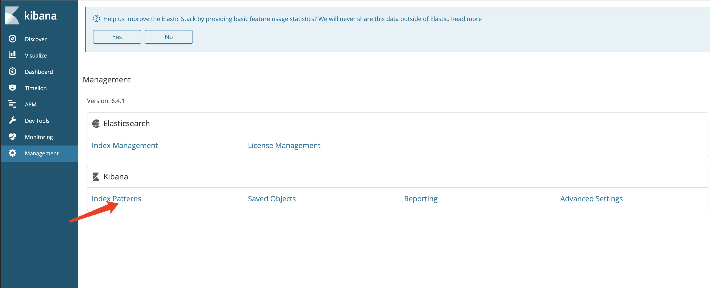
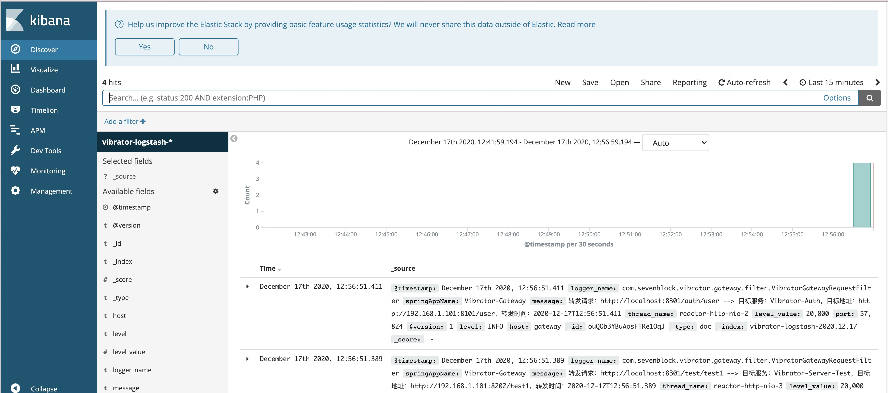

ELK即Elasticsearch、Logstash和Kibana首字母缩写。Elasticsearch用于存储日志信息，Logstash用于收集日志，Kibana用于图形化展示。

在Spring Cloud微服务架构下，打印Log一般用的库是spring-boot-starter-logging，但是有个缺点是日志都散落在各个微服务下面，需要一个媒介来收集，存储和展示，ELK三者就是干这个事儿的。

这两天用docker整合了这三者，在此记录一下。

### 创建并启动容器

创建docker-compose.yml，这三个容器用的网络依然是我之前在  的自定义网络。

<!-- more -->

```yml
version: '3'
services:
  elasticsearch:
    image: elasticsearch:6.4.1
    container_name: elasticsearch
    environment:
      - "cluster.name=elasticsearch" #集群名称为elasticsearch
      - "discovery.type=single-node" #单节点启动
      - "ES_JAVA_OPTS=-Xms512m -Xmx512m" #jvm内存分配为512MB
    volumes:
      - ./elasticsearch/plugins:/usr/share/elasticsearch/plugins
      - ./elasticsearch/data:/usr/share/elasticsearch/data
    ports:
      - 9200:9200

  kibana:
    image: kibana:6.4.1
    container_name: kibana
    depends_on:
      - elasticsearch
    environment:
      - "elasticsearch.hosts=http://elasticsearch:9200" #容器名作为域名
    ports:
      - 5601:5601
  logstash:
    image: logstash:6.4.1
    container_name: logstash
    volumes:
      - ./logstash/logstash-vibrator.conf:/usr/share/logstash/pipeline/logstash.conf
    depends_on:
      - elasticsearch
    ports:
      - 4560:4560

networks:
  default:
    external:
     name: vibrator
```

在当前目录下，创建这样的目录结构
```
./
|-elasticsearch
   |- data
   |- elasticsearch/plugins
|- logstash
|- logstash-vibrator.conf
```
logstash-vibrator.conf是logstash配置。
```python
input {
  tcp {
    mode => "server"
    host => "0.0.0.0"
    port => 4560
    codec => json_lines
  }
}
output {
  elasticsearch {
    hosts => "elasticsearch:9200"
    index => "vibrator-logstash-%{+YYYY.MM.dd}"
  }
}
```
input表示收集来自客户端(spring cloud各个微服务)的日志，output表示发送到elasticsearch。hosts可以直接用elasticsearch作为域名。vibrator-logstash是索引文件，要在Kibana填写的。

在启动容器之前，先要修改电脑的虚拟内存，否则elasticsearch容器跑不起来，或者跑起来之后也会挂掉。

修改方法参见：[修改虚拟内存](https://www.elastic.co/guide/en/elasticsearch/reference/current/docker.html#docker-prod-prerequisites)

例如我的mac的方法是：
```
screen ~/Library/Containers/com.docker.docker/Data/vms/0/tty

sysctl -w vm.max_map_count=262144
```
### 添加pom依赖
```xml
<dependency>
    <groupId>net.logstash.logback</groupId>
    <artifactId>logstash-logback-encoder</artifactId>
    <version>6.1</version>
</dependency>
```
### 配置logback-spring.xml
在各个微服务的resource目录下添加logback-spring.xml文件
```xml
<?xml version="1.0" encoding="UTF-8"?>
<configuration scan="true" scanPeriod="60 seconds" debug="false">
    <contextName>vibrator</contextName>
    <springProperty scope="context" name="springAppName" source="spring.application.name"/>
    <property name="log.path" value="log/vibrator-gateway" />
    <property name="log.maxHistory" value="15" />
    <property name="log.colorPattern" value="%magenta(%d{yyyy-MM-dd HH:mm:ss}) %highlight(%-5level) %boldCyan([${springAppName:-},%X{X-B3-TraceId:-},%X{X-B3-SpanId:-},%X{X-Span-Export:-}]) %yellow(%thread) %green(%logger) %msg%n"/>
    <property name="log.pattern" value="%d{yyyy-MM-dd HH:mm:ss} %-5level [${springAppName:-},%X{X-B3-TraceId:-},%X{X-B3-SpanId:-},%X{X-Span-Export:-}] %thread %logger %msg%n"/>

    <!--输出到控制台-->
    <appender name="console" class="ch.qos.logback.core.ConsoleAppender">
        <encoder>
            <pattern>${log.colorPattern}</pattern>
        </encoder>
    </appender>

    <!--输出到文件-->
    <appender name="file_info" class="ch.qos.logback.core.rolling.RollingFileAppender">
        <rollingPolicy class="ch.qos.logback.core.rolling.TimeBasedRollingPolicy">
            <fileNamePattern>${log.path}/info/info.%d{yyyy-MM-dd}.log</fileNamePattern>
            <MaxHistory>${log.maxHistory}</MaxHistory>
        </rollingPolicy>
        <encoder>
            <pattern>${log.pattern}</pattern>
        </encoder>
        <filter class="ch.qos.logback.classic.filter.LevelFilter">
            <level>INFO</level>
            <onMatch>ACCEPT</onMatch>
            <onMismatch>DENY</onMismatch>
        </filter>
    </appender>

    <appender name="file_error" class="ch.qos.logback.core.rolling.RollingFileAppender">
        <rollingPolicy class="ch.qos.logback.core.rolling.TimeBasedRollingPolicy">
            <fileNamePattern>${log.path}/error/error.%d{yyyy-MM-dd}.log</fileNamePattern>
        </rollingPolicy>
        <encoder>
            <pattern>${log.pattern}</pattern>
        </encoder>
        <filter class="ch.qos.logback.classic.filter.LevelFilter">
            <level>ERROR</level>
            <onMatch>ACCEPT</onMatch>
            <onMismatch>DENY</onMismatch>
        </filter>
    </appender>

    <appender name="logstash" class="net.logstash.logback.appender.LogstashTcpSocketAppender">
        <destination>localhost:4560</destination>
        <encoder charset="UTF-8" class="net.logstash.logback.encoder.LogstashEncoder"/>
    </appender>

    <root level="debug">
        <appender-ref ref="console" />
    </root>

    <root level="info">
        <appender-ref ref="file_info" />
        <appender-ref ref="file_error" />
        <appender-ref ref="logstash" />
    </root>
</configuration>
```
其中, logstash的目标配置成localhost:4560，是因为我的logstash容器跑在本机。

### 启动微服务打印日志

### 进入kibana管理页面。http://localhost:5601/

#### 添加索引

点击Index Patterns配置上面提到的索引: vibrator-logstash-*

#### 查看索引日志

可看到对应的索引下面有日志打印出来。


### 参考资料
- https://www.elastic.co/guide/en/elasticsearch/reference/current/docker.html#docker-prod-prerequisites