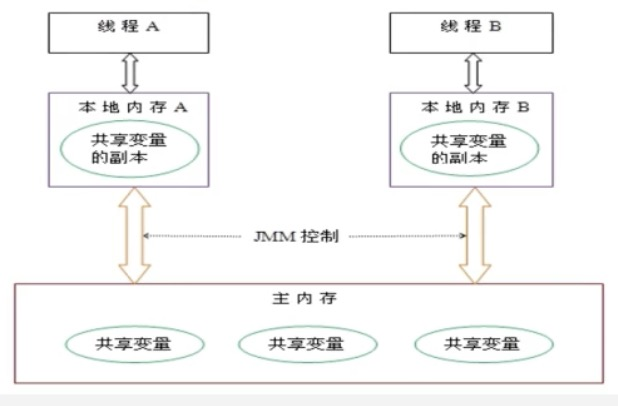
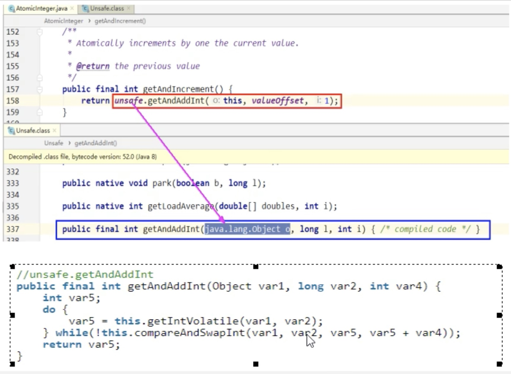
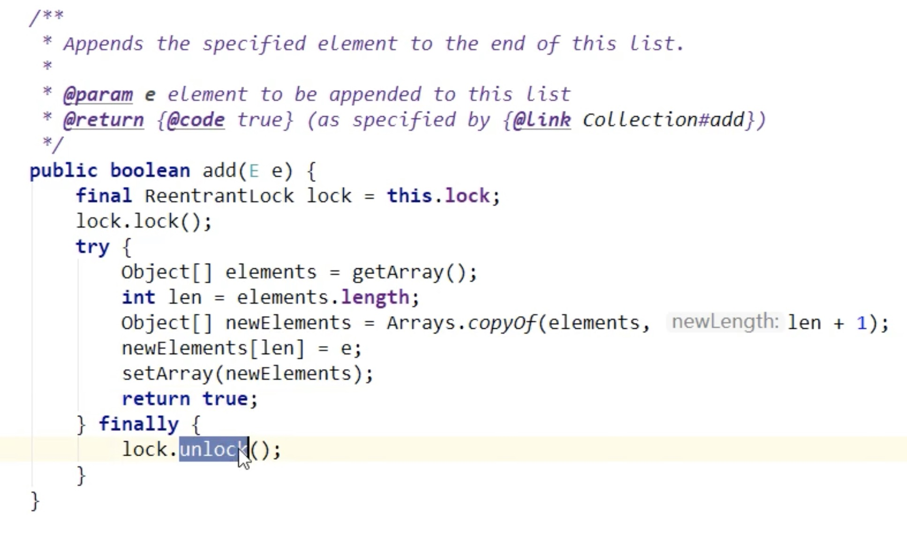
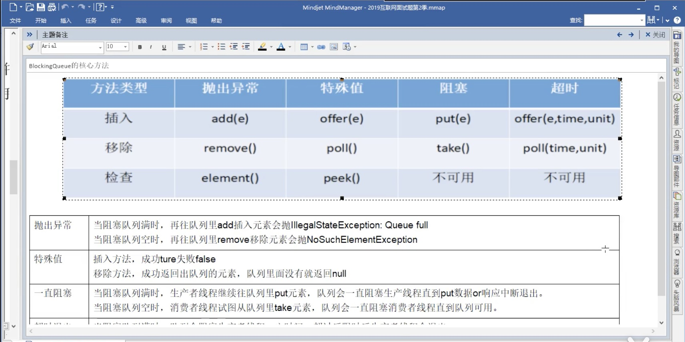

### 请谈谈你对volatile的理解.

volatile是java虚拟机提供的轻量级同步机制。 
- 保证可见性

以下内容参考[04_可见性的代码验证说明](https://www.bilibili.com/video/BV18b411M7xz?p=4)，验证代码来源：[VolatileDemo.java](https://gitee.com/johnnyzzz/interview-demo/blob/master/src/com/yinlijun/interview/juc/VolatileDemo.java)

基于JMM的理论，一个线程修改了主内存里的volatile修饰的变量值，其他线程马上获得通知。

<!--more-->
代码：
```java
package com.yinlijun.interview.juc;

/**
 * Brief: 验证volatile关键字的可见性。
 * volatile关键字可以检测到其他内存对所修饰变量的修改，并且将变量值其他线程的的内存空间。
 * 否则，main函数的while循环一直在空转，得不到通知。
 *
 * 但奇怪的是，如果没有加volatile，而是在main的while循环内加上休眠，也能能获取到该变量的最新值。
 * 可能的原因只，休眠之后（或者IO），主线程会换出cpu执行，再次执行时会同步主内存的内容。
 * 为了验证这一点，while函数不休眠，只打印（IO也会让出cpu）。果然，while循环也能读取到最新值并退出。
 * 因此可以总结出一点，只要当前线程只要让出了cpu，再次运行时，会同步主内存的变量。
 *
 * @author YinLijun <yinlijun2004@gmail.com>
 * @date created in 2020-11-20 12:14
 */
class Student {
    volatile int age;
    //int age;
    Student() {
        this.age = 0;
    }
}
public class VolatileDemo {
    public static void main(String[] args) {
        Student s = new Student();
        new Thread(() -> {
            try {
                System.out.println(Thread.currentThread().getName() + " come in");
                Thread.sleep(1000);
                s.age = 30;
                System.out.println(Thread.currentThread().getName() + " update age: " + s.age);
            } catch (InterruptedException e) {
                e.printStackTrace();
            }
        }).start();

        while (s.age == 0) {
            //让出CPU方式1，休眠。
            /*
            try {
                Thread.sleep(1000);
            } catch (InterruptedException e) {
                e.printStackTrace();
            }
            */
            //让出CPU2，访问IO
            //System.out.println("main thread age:" + s.age);
        }
        System.out.println("main thread age:" + s.age);
    }
}
```

- 不保证原子性

原子性，表示某个线程在做某些业务流程时，不可被打断，加塞，要么同时成功，要么同时失败。

age++操作，在字节码层面，被分解了3次条字节码指令，因此可能被打断，导致2条线程拿到同一个age值,导致少一次累加效果。

代码
```java
package com.yinlijun.interview.juc;

/**
 * Brief: 验证volatile的不保证原子性。
 *
 * 程序跑完之后，age值往往是不足20000，充分说明了volatile不保证原子性。
 * 
 * 注意：我发现一个现象，加入main函数里的测试程序循环运行10000次，假如
 * age没有volatile修饰，程序很快就结束了，而且age大概率是20000，出现非
 * 20000的概率很小，我才原因是因为volatile会触发线程调度，线程切换的耗时
 * 延长了程序运行时间。
 * @author YinLijun <yinlijun2004@gmail.com>
 * @date created in 2020-11-20 12:51
 */

public class VolatileDemo2 {
    public static void main(String[] args) {
        Student s = new Student();
        for (int i = 0; i < 20; i++) {
            new Thread(() -> {
                for (int j = 0; j < 1000; j++) {
                    s.age++;
                }
            }, String.valueOf(i)).start();
        }
        while (Thread.activeCount() > 2) {
            Thread.yield();
        }
        System.out.println("main thread age:" + s.age);
    }
}
```
如何解决volatile非原子性的问题

使用AtomicInteger。
```java
package com.yinlijun.interview.juc;

/**
 * Brief: 使用AtomicInteger保证原子性。
 *
 *
 * @author YinLijun <yinlijun2004@gmail.com>
 * @date created in 2020-11-20 12:51
 */
public class Student {
    AtomicInteger atomAge = new AtomicInteger();
    volatile int age;
    public Student() {
        this.age = 0;
    }
}
public class VolatileDemo3 {
    public static void main(String[] args) {
        Student s = new Student();
        for (int i = 0; i < 20; i++) {
            new Thread(() -> {
                for (int j = 0; j < 1000; j++) {
                    s.age++;
                    s.atomAge.getAndIncrement();
                }
            }, String.valueOf(i)).start();
        }
        while (Thread.activeCount() > 2) {
            Thread.yield();
        }
        System.out.println("main thread age:" + s.age);
        System.out.println("main thread atomAge:" + s.atomAge);
    }
}
```

- 禁止指令重排

JVM会在volatile指令前后，禁止指令重排。

#### JMM（Java Momoery Model）java内存模型。

- 可见性
- 原子性
- 有序性

JMM本身是一种抽象的概念，并不真实存在。它描述的是一组规则或规范，通过这组规范定义了程序中的各个变量（包括实例字段，静态字段和构成数组对象的元素）的访问方式。

JMM关于同步的规定：
- 线程解锁前，必须要把共享变量的值刷新会主存。
- 线程加锁前，必须读取主内存的最新值到自己的工作内存。
- 加锁解锁是同一把锁。

由于JVM运行程序的实体是线程，而每个线程创建时JVM都会为其创建一个工作内存（栈空间），工作内存是每个线程的私有数据区域，而Java内存模型中规定所有的变量都存储在<b>主内存</b>，主内存是共享内存区域, 所有线程都可以访问。<b>但对内存的操作（读取赋值）等必须在工作内存中进行，所以要讲变量中主内存拷贝到自己的工作内存空间，然后对变量进行操作，操作完成在将变量协会到主内存。</b>不能直接操作主内存中的变量，各个线程中的工作内存中存储这主内存的<b>变量副本拷贝</b>，因此不同的线程无法访问对方的工作内存，线程间的通信（传值）必须通过主内存来完成，其简要访问过程如下：


#### 你在哪些地方用到过volatile.
- 单例模式
- 读写锁，手写缓存
- CAS,JUC里面大量用到

##### DCL(Double Check Lock)实现单例模式的隐患
典型的DCL可以满足99.99%的概率，但是在极端情况下，由于指令被重排，造成隐患。
```java
public class SingletonDemo {
    public static SingletonDemo instance = null;

    public SingletonDemo() {
        System.out.println("我是构造方法SingletonDemo");
    }
    
    /**
     * DCL（Double Check Lock）模式
     * @return
     */
    public static SingletonDemo getInstance3() {
        if(instance == null) {
            synchronized (SingletonDemo.class) {
                if(instance == null) {
                    instance = new SingletonDemo();
                }
            }
        }
        return instance;
    }


    public static void main(String[] args) {
        for (int i = 0; i < 50; i++) {
            new Thread(() -> {
                SingletonDemo singletonDemo = SingletonDemo.getInstance3();
            }).start();
        }
    }
}
```
```java
instance = new SingletonDemo(); 可以分为以下3步

memory = allocate(); //1. 分配内存空间
instance(momoery);   //2. 初始化对象
instance = memory;   //3. 设置instance指向刚分配的内存地址。此时instance != null
```
由于指令2，3之间没有依赖关系，因此可能被重排成如下：
```java
memory = allocate(); //1. 分配内存空间
instance = memory;   //3. 设置instance指向刚分配的内存地址。此时instance != null，但是对象没有初始化完成。这是别的线程可以用对象，但是对象里面的成员是没有初始化的。
instance(momoery);   //2. 初始化对象
```

因此需要在instance上加上volatile规避这种情况，保证在多线程间的语义一致性。

如下：
```java
public class SingletonDemo {
    public static volatile SingletonDemo instance = null;

    public SingletonDemo() {
        System.out.println("我是构造方法SingletonDemo");
    }
    
    /**
     * DCL（Double Check Lock）模式
     * @return
     */
    public static SingletonDemo getInstance3() {
        if(instance == null) {
            synchronized (SingletonDemo.class) {
                if(instance == null) {
                    instance = new SingletonDemo();
                }
            }
        }
        return instance;
    }


    public static void main(String[] args) {
        for (int i = 0; i < 50; i++) {
            new Thread(() -> {
                SingletonDemo singletonDemo = SingletonDemo.getInstance3();
            }).start();
        }
    }
}
```


### CAS你知道吗?

CAS：比较并交换，是一条CPU并发原语，功能是判断内存中某个位置的值，是否是期望的值，如果是，则改为更新的值，这个过程是原子的。


#### CAS的原理，自旋锁+UnSafe

Unsafe是CAS的核心类，来源于sun.misc.Unsafe，里面的方法都是是native方法。

Unsafe类可以直接操作特定内存中的数据。像C操作指针一样。

Unsafe的变量valueOffset，表示value在内存中的偏移地址。Unsafe根据这个偏移地址取数据。

CAS原理，以AtomicInteger的getAndIncrement方法为例，调用栈：

注意最后一个函数getAndInt。
其中getIntVolatile是原子操作，compareAndSwapInt也是原子操作。

先getIntVolatile获取现在的值，然后compareAndSwapInt进行+1操作，如果两条指令之间无人修改，则可以改成功，跳出循环，否则修改失败，继续循环，这样可以保证整个累加不会冲突。

getIntVolatile取出来的var5是5，但是compareAndSwapInt设置6失败，说明5到6之间已经有人修改了，则继续重试，知道修改成功。

#### CAS的缺点
- 循环时间长，CPU开销比较大
- 只能保证一个共享变量的原子操作
- 引出来ABA问题

#### CAS和synchronized的比较
synchronized为了一致性损失了并发性，CAS兼顾了一致性和并发性，但是CAS也有ABA问题。

### 原子类AtomicInteger的ABA问题谈谈？原子更新引用知道吗？

CAS算法实现一个重要前提是需要取出内存中某个时刻的数据并在当下时刻比较并替换，那么在这个时间差会导致数据的变化。

比如说一个线程one从内存位置V中取出A，这时候另一个线程two也从内存中取出A，并且线程tow进行了一些操作将值变成了B，然后线程tow又将V位置的数据变成A，这个时候线程one进行CAS操作发现内存中仍然是A，然后线程one操作成功。

<b>尽管线程one的CAS操作成功，但是不代表这个过程是没有问题的。</b>

原子引用Demo
```java
class DemoStudent {
    private String name;
    private int age;
    DemoStudent(int age, String name) {
        this.name = name;
        this.age = age;
    }

    @Override
    public String toString() {
        return "name:" + name + " age:" + age;
    }
}

public class AtomicReferenceDemo {
    public static void main(String[] args) {
        DemoStudent z3 = new DemoStudent(22, "z3");
        DemoStudent l4 = new DemoStudent(24, "l4");
        AtomicReference<DemoStudent> stu = new AtomicReference<>(z3);
        System.out.println(stu.compareAndSet(z3, l4) + "\t" + stu.get().toString());
        System.out.println(stu.compareAndSet(z3, l4) + "\t" + stu.get().toString());

    }
}
```
输出
```
true	name:l4 age:24
false	name:l4 age:24
```

#### 如何规避ABA问题

引入版本号，即AtomicStampedReference，当前线程修改前前获取版本号，在设置时，将版本号，和期望的版本号传入。

实例代码：
```java
package com.yinlijun.interview.juc;

import java.util.concurrent.atomic.AtomicReference;
import java.util.concurrent.atomic.AtomicStampedReference;

/**
 * Brief: ABA问题的解决
 *
 * @author YinLijun <yinlijun2004@gmail.com>
 * @date created in 2020-11-20 17:51
 */
public class ABASolutionDemo {
    public static void main(String[] args) {
        AtomicReference<Integer> atomicReference = new AtomicReference<>(100);

        new Thread(() -> {
            System.out.println("t2: " + atomicReference.compareAndSet(100, 101) +  "\t " + atomicReference.get());
            System.out.println("t2: " + atomicReference.compareAndSet(101, 100) +  "\t " + atomicReference.get());
        }, "t1").start();
        new Thread(() -> {
            try {
                Thread.sleep(1000);
            } catch (InterruptedException e) {
                e.printStackTrace();
            }
            System.out.println("t2: " + atomicReference.compareAndSet(100, 2019) +  "\t " + atomicReference.get());
            System.out.println("ABA问题引入，数据成功被t2修改为2019，对t1的中间修改无感知");
        }, "t2").start();

        try {
            Thread.sleep(3000);
            System.out.println("\r\n");
        } catch (InterruptedException e) {
            e.printStackTrace();
        }

        AtomicStampedReference<Integer> atomicStampedReference = new AtomicStampedReference<>(100, 1);

        new Thread(() -> {
            int stamp = atomicStampedReference.getStamp();
            try {
                Thread.sleep(1000);
            } catch (InterruptedException e) {
                e.printStackTrace();
            }
            boolean result = atomicStampedReference.compareAndSet(100, 101, stamp, stamp + 1);
            System.out.println("t3 修改 " + (result ? "成功" : "失败") + " 时间戳：" + atomicStampedReference.getStamp());
            stamp = atomicStampedReference.getStamp();
            result = atomicStampedReference.compareAndSet(101, 100, stamp, stamp + 1);
            System.out.println("t3 修改 " + (result ? "成功" : "失败") + " 时间戳：" + atomicStampedReference.getStamp());
        }, "t3").start();

        new Thread(() -> {
            int stamp = atomicStampedReference.getStamp();
            try {
                Thread.sleep(2000);
            } catch (InterruptedException e) {
                e.printStackTrace();
            }
            boolean result = atomicStampedReference.compareAndSet(100, 2019, stamp, stamp + 1);
            System.out.println("t4 修改 " + (result ? "成功" : "失败") + " 时间戳：" + atomicStampedReference.getStamp());
            System.out.println("ABA问题在用AtomicStampedReference引入计数后得到解决");
        }, "t4").start();
    }
}

```
打印
```
t2: true	 101
t2: true	 100
t2: true	 2019
ABA问题引入，数据成功被t2修改为2019，对t1的中间修改无感知


t3 修改 成功 时间戳：2
t3 修改 成功 时间戳：3
t4 修改 失败 时间戳：3
ABA问题在用AtomicStampedReference引入计数后得到解决
```

### 我们知道ArrayList是线程不安全，请编写一个不安全的案例，并给出解决方案。
举例
```java
public class ArrayListConcurrentDemo {
    public static void main(String[] args) {
        List<String> list = new ArrayList<>();

        for (int i = 0; i < 100; i++) {
            new Thread(() -> {
                list.add(UUID.randomUUID().toString());
            }, String.valueOf(i)).start();
        }
        try {
            Thread.sleep(1000);
        } catch (InterruptedException e) {
            e.printStackTrace();
        }
        if(list.size() < 100) {
            System.out.println("数组长度：" + list.size());
        }
    }
}
```
打印
```
数组长度：99
```
解决方案
```java
//方法1
new Vector();

//方法2
List<String> list = Collections.synchronizedList(new ArrayList<>());

//方法3 
List<String> list = new java.util.concurrent.CopyOnWriteArrayList<>();
```
写时复制技术，CopyOnWriteArrayList的add源码。 


同理
- set 
HashSet也是线程不安全的。

解决方案
```java
//方法1 HashSet底层是HashMap，add的时候key是参数, value是PRESET的常量。
Set<String> set = Collections.synchronizedSet(new HashSet<>());

//方法2 CopyOnWriteArraySet底层其实也是CopyOnWriteArrayList实现的。
Set<String> set = new CopyOnWriteArraySet<String>();

```

- map
HashMap也是线程不安全的。

解决方案
```java
//方法1
Map<String, String> map = Collections.synchronizedMap(new HashMap<>());

//方法2
Map<String, String> map = new ConcurrentHashMap<>();
```

### 公平锁/非公平锁/可重入锁/递归锁/自旋锁谈谈你的理解。

- 公平锁和非公平锁

公平锁和非公平锁，是指抢占锁的时候会不会遵循先来好后到的顺序。

ReentrantLock的构造参数可以传入boolean值表示公平与非公平，无参构造函数默认非公平。

非公平锁可能会造成饥饿现象，有的线程一直拿不到锁。

非公平锁的吞吐量比公平锁大。

synchronized也是非公平锁。

- 可重入锁（也叫递归锁）
拿到锁可以自动获取同一把锁。

synchronized 和 ReentrantLock都是可重入锁。

可重入锁的最大作用是避免死锁。

```java
package com.yinlijun.interview.juc;

import java.util.concurrent.locks.ReentrantLock;

/**
 * Brief: ReentrantLock和synchronized是典型的可重入锁
 *
 * @author YinLijun <yinlijun2004@gmail.com>
 * @date created in 2020-11-20 19:40
 */
public class ReentrantLockDemo {
    ReentrantLock lock = new ReentrantLock();

    public void m2() {
        lock.lock();
        try {
            System.out.println(Thread.currentThread().getName() + " " + "m2");
        } finally {
            lock.unlock();
        }
    }
    public void m1() {
        lock.lock();
        try {
            System.out.println(Thread.currentThread().getName() + " " + "m1");
            m2();
        } finally {
            lock.unlock();

        }
    }

    public synchronized void m3() {
        System.out.println(Thread.currentThread().getName() + " " + "m3");
        m4();
    }

    public synchronized void m4() {
        System.out.println(Thread.currentThread().getName() + " " + "m4");
    }

    public static void main(String[] args) {
        ReentrantLockDemo demo = new ReentrantLockDemo();
        new Thread(() -> {
            demo.m1();
        }, "t1").start();
        new Thread(() -> {
            demo.m1();
        }, "t2").start();
        new Thread(() -> {
            demo.m3();
        }, "t3").start();
        new Thread(() -> {
            demo.m3();
        }, "t4").start();
    }
}
```
打印：
```
t1 m1
t1 m2
t2 m1
t2 m2
t3 m3
t3 m4
t4 m3
t4 m4
```

- 自旋锁

尝试获取锁的线程，不会立即挂起，而是while循环不断的尝试获取锁。优点是减少上下文的切换，缺点是会消耗CPU。

手写自旋锁DEMO
```java
package com.yinlijun.interview.juc;

import java.util.concurrent.atomic.AtomicReference;

/**
 * Brief: 自旋锁。
 *
 * @author YinLijun <yinlijun2004@gmail.com>
 * @date created in 2020-11-20 20:07
 */
public class SpinLockDemo {
    AtomicReference<Thread> atomicReference = new AtomicReference<>();

    public void lock() {
        System.out.println(Thread.currentThread().getName() + " come in");
        while (!atomicReference.compareAndSet(null, Thread.currentThread())) {

        }
        System.out.println(Thread.currentThread().getName() + " lock");
    }

    public void unlock() {
        atomicReference.compareAndSet(Thread.currentThread(), null);
        System.out.println(Thread.currentThread().getName() + " unlock");
    }

    public static void main(String[] args) {
        SpinLockDemo demo = new SpinLockDemo();
        new Thread(() -> {
            demo.lock();
            try {
                Thread.sleep(5000);
            } catch (InterruptedException e) {
                e.printStackTrace();
            } finally {
                demo.unlock();
            }
        }, "thread-1").start();

        new Thread(() -> {
            try {
                Thread.sleep(1000);
            } catch (InterruptedException e) {
                e.printStackTrace();
            }
            demo.lock();
            try {
                Thread.sleep(1000);
            } catch (InterruptedException e) {
                e.printStackTrace();
            } finally {
                demo.unlock();
            }
        }, "thread-2").start();
    }
}
```
打印：
```
thread-1 come in
thread-1 lock
thread-2 come in
thread-1 unlock
thread-2 lock
thread-2 unlock
```

- 独占锁(写锁)和共享锁(读锁)

独占锁，是指锁只能被一个线程锁持有，对ReentrantLock和synchronized都是独占锁。

共享锁，是指该锁可以被多个线程同时占有。

对ReentrantReadWriteLock而言，读锁是共享锁，写锁是独占锁。

读锁的共享锁可以保证并发读是非常高效的，读写，写读，写写的过程是互斥的。

读写锁demo:
```java
package com.yinlijun.interview.juc;

import java.util.HashMap;
import java.util.Map;
import java.util.concurrent.locks.ReentrantReadWriteLock;

/**
 * Brief:
 *
 * @author YinLijun <yinlijun2004@gmail.com>
 * @date created in 2020-11-20 20:34
 */
class MyCache {
    private volatile Map<String, Object> map = new HashMap<>();
    ReentrantReadWriteLock rwLock = new ReentrantReadWriteLock();

    public void put(String key, Object value) {
        rwLock.writeLock().lock();
        try {
            System.out.println(Thread.currentThread().getName() + " 正在写入");
            try {
                Thread.sleep(1000);
            } catch (InterruptedException e) {
                e.printStackTrace();
            }
            map.put(key, value);
            System.out.println(Thread.currentThread().getName() + " 写入完成");
        } finally {
            rwLock.writeLock().unlock();
        }
    }

    public void get(String key) {
        rwLock.readLock().lock();
        try {
            System.out.println(Thread.currentThread().getName() + " 正在读取");
            try {
                Thread.sleep(1000);
            } catch (InterruptedException e) {
                e.printStackTrace();
            }
            Object result = map.get(key);
            System.out.println(Thread.currentThread().getName() + " 读取完成 " + result);
        } finally {
            rwLock.readLock().unlock();
        }
    }
}
public class ReetranReadWriteLockDemo {
    public static void main(String[] args) {
        MyCache cache = new MyCache();

        for (int i = 0; i < 5; i++) {
            final int v = i;
            new Thread(() -> {
                cache.put(String.valueOf(v), String.valueOf(v));
            }, "put thread-" + i).start();
        }

        for (int i = 0; i < 5; i++) {
            final int ti = i;
            new Thread(() -> {
                cache.get(String.valueOf(ti));
            }, "get thread-" + i).start();
        }
    }
}
```
打印：
```
put thread-0 正在写入
put thread-0 写入完成
put thread-1 正在写入
put thread-1 写入完成
put thread-2 正在写入
put thread-2 写入完成
put thread-3 正在写入
put thread-3 写入完成
put thread-4 正在写入
put thread-4 写入完成
get thread-0 正在读取
get thread-1 正在读取
get thread-2 正在读取
get thread-3 正在读取
get thread-4 正在读取
get thread-0 读取完成 0
get thread-2 读取完成 2
get thread-4 读取完成 4
get thread-1 读取完成 1
get thread-3 读取完成 3
```

### CountDownLatch和CyclicBarrier/Semaphore使用过吗?

CountDownLatch的demo
```java
package com.yinlijun.interview.juc;

import java.util.concurrent.CountDownLatch;

/**
 * Brief: CountDownLatchDemo
 *
 * @author YinLijun <yinlijun2004@gmail.com>
 * @date created in 2020-11-20 20:59
 */
public class CountDownLatchDemo {
    public static void main(String[] args) {
        CountDownLatch latch = new CountDownLatch(6);
        for (int i = 0; i < 6; i++) {
            new Thread(() -> {
                try {
                    Thread.sleep(1000);
                } catch (InterruptedException e) {
                    e.printStackTrace();
                }
                System.out.println(Thread.currentThread().getName() + " completed");
                latch.countDown();
            }, "thread-" + i).start();
        }
        try {
            latch.await();
        } catch (InterruptedException e) {
            e.printStackTrace();
        } finally {
            System.out.println("main thread completed");
        }
    }
}
```
打印
```
thread-0 completed
thread-2 completed
thread-3 completed
thread-1 completed
thread-5 completed
thread-4 completed
main thread completed
```

CyclicBarrier Demo
```java
package com.yinlijun.interview.juc;

import java.util.concurrent.BrokenBarrierException;
import java.util.concurrent.CyclicBarrier;

/**
 * Brief: CyclicBarrier demo
 *
 * @author YinLijun <yinlijun2004@gmail.com>
 * @date created in 2020-11-20 21:05
 */
public class CyclicBarrierDemo {
    public static void main(String[] args) {
        CyclicBarrier barrier = new CyclicBarrier(7, () -> {
            System.out.println("召唤神龙!!");
        });
        for (int i = 0; i < 7; i++) {
            final int ti = i;
            new Thread(() -> {
                System.out.println(Thread.currentThread().getName() + "搜集到第" + ti + "颗龙珠");
                try {
                    barrier.await();
                } catch (InterruptedException | BrokenBarrierException e) {
                    e.printStackTrace();
                }
            }, "thread-" + i).start();
        }
    }
}
```
打印
```
thread-1搜集到第1颗龙珠
thread-3搜集到第3颗龙珠
thread-2搜集到第2颗龙珠
thread-4搜集到第4颗龙珠
thread-0搜集到第0颗龙珠
thread-6搜集到第6颗龙珠
thread-5搜集到第5颗龙珠
召唤神龙!!
```

#### Semaphore
semaphore 信号量用于两个目的，一个用于共享资源的互斥使用，另一个用户并发线程数的控制。

Demo
```java
package com.yinlijun.interview.juc;

import java.util.concurrent.Semaphore;

/**
 * Brief: Semaphore Demo
 *
 * @author YinLijun <yinlijun2004@gmail.com>
 * @date created in 2020-11-20 21:17
 */
public class SemaphoreDemo {
    public static void main(String[] args) {
        /**
         * 第一个参数，信号量数量，
         * 第二个参数，是否公平锁
         */
        Semaphore semaphore = new Semaphore(3, false);
        for (int i = 0; i < 6; i++) {
            new Thread(() -> {
                try {
                    semaphore.acquire();
                    System.out.println(Thread.currentThread().getName() + " got permit");
                    Thread.sleep(3000);
                } catch (InterruptedException e){
                    e.printStackTrace();
                } finally {
                    semaphore.release();
                    System.out.println(Thread.currentThread().getName() + " release permit");
                }
            }, "thread-" + i).start();
        }
    }
}
```
打印
```
thread-0 got permit
thread-1 got permit
thread-2 got permit
thread-2 release permit
thread-3 got permit
thread-0 release permit
thread-1 release permit
thread-5 got permit
thread-4 got permit
thread-5 release permit
thread-3 release permit
thread-4 release permit
```

### 阻塞队列(BlockingQueue)知道吗？

Collection <-- Queue <-- BlockingQueue

实现BlockQueue接口的类
- <font color='#f00'>ArrayListBlockingQueue 由数组结构组成的有界阻塞队列。</font>
- <font color='#f00'>LinkedBlockingQueue 由链表组成的有界（大小默认为Integer.MAX_VALUE）阻塞队列。</font>
- PriorityBlockingQueue 支持优先级排序的无界阻塞队列
- DelayQueue 使用优先级队列实现的延迟无界阻塞队列。
- <font color='#f00'>SynchronousQueue 不存储元素的阻塞队列，也即单个元素的队列。</font>
- LinkedTransferQueue 由链表结构组成的无界阻塞队列。
- LinkedBlocking<font color='pink'>Deque</font> 由链表结构组成的双向阻塞队列。

常用接口


```java
package com.yinlijun.interview.juc;

import java.util.UUID;
import java.util.concurrent.ArrayBlockingQueue;
import java.util.concurrent.BlockingQueue;
import java.util.concurrent.TimeUnit;

/**
 * Brief:
 *
 * @author YinLijun <yinlijun2004@gmail.com>
 * @date created in 2020-11-20 21:27
 */
public class BlockingQueueDemo {
    public static void main(String[] args) {
        BlockingQueue<String> queue = new ArrayBlockingQueue<>(3);

        for (int i = 0; i < 6; i++) {
            new Thread(() -> {
                try {
                    Thread.sleep(10000);
                } catch (InterruptedException e) {
                    e.printStackTrace();
                }
                String s = UUID.randomUUID().toString().substring(0, 8);
                try {
                    boolean result = queue.offer(s, 5, TimeUnit.SECONDS);
                    System.out.println(Thread.currentThread().getName() + " produce " + (result ? s + " success" : "failed"));
                } catch (InterruptedException e) {
                    e.printStackTrace();
                    System.out.println(Thread.currentThread().getName() + " produce " + s + " failed");
                }

            }, "produce-" + i).start();
        }
        for (int i = 0; i < 6; i++) {
            new Thread(() -> {
                try {
                    try {
                        Thread.sleep(1000);
                    } catch (InterruptedException e) {
                        e.printStackTrace();
                    }
                    String s = queue.poll(1, TimeUnit.SECONDS);
                    System.out.println(Thread.currentThread().getName() + " consume " + (s == null ? "failed" :  s + " success"));
                } catch (InterruptedException e) {
                    e.printStackTrace();
                }
            }, "consumer-" + i).start();
        }
    }
}
```
打印
```
consumer-2 consume failed
consumer-1 consume failed
consumer-0 consume failed
consumer-4 consume failed
consumer-3 consume failed
consumer-5 consume failed
produce-0 produce 6d1cdb20 success
produce-3 produce ae4239cc success
produce-2 produce 2dba2ddf success
produce-4 produce failed
produce-1 produce failed
produce-5 produce failed
```

SynchronousQueue Demo
```java
package com.yinlijun.interview.juc;

import java.util.concurrent.BlockingQueue;
import java.util.concurrent.SynchronousQueue;

/**
 * Brief: SynchronousQueue Demo
 *
 * @author YinLijun <yinlijun2004@gmail.com>
 * @date created in 2020-11-20 22:01
 */
public class SynchronousQueueDemo {
    public static void main(String[] args) {
        BlockingQueue<Integer> queue = new SynchronousQueue<>();
        new Thread(() -> {
            try {
                for (int i = 0; i < 3; i++) {
                    queue.put(i);
                    System.out.println(Thread.currentThread().getName() + " produce " + i + " success");
                }
            } catch (InterruptedException e) {
                e.printStackTrace();
            }
        }, "produce thread").start();

        new Thread(() -> {
            try {
                for (int i = 0; i < 3; i++) {
                    Thread.sleep(2000);
                    int v = queue.take();
                    System.out.println(Thread.currentThread().getName() + " take " + v);
                }
            } catch (InterruptedException e) {
                e.printStackTrace();
            }
        }, "consumer thread").start();
    }
}
```
打印
```
consumer thread take 0
produce thread produce 0 success
produce thread produce 1 success
consumer thread take 1
produce thread produce 2 success
consumer thread take 2
```

阻塞队列用在哪里
- 生产者消费者模式
- 线程池
- 消息中间件

### 手写传统的生产消费者demo
注意资源判断要用while，防止虚假唤醒
代码
```java
package com.yinlijun.interview.juc;

import java.util.concurrent.locks.Condition;
import java.util.concurrent.locks.Lock;
import java.util.concurrent.locks.ReentrantLock;

/**
 * Brief: 传统生产消费者
 *
 * @author YinLijun <yinlijun2004@gmail.com>
 * @date created in 2020-11-23 11:56
 */
class MyShareData {
    private int number = 0;
    private Lock locker = new ReentrantLock();
    private Condition condition = locker.newCondition();

    public void increment() {
        locker.lock();
        try {
            //用 while，不用if，防止虚假唤醒
            while (number != 0) {
                condition.await();
            }
            number++;
            System.out.println(Thread.currentThread().getName() + " produce done, number:" + number);
            condition.signalAll();
        } catch (InterruptedException e) {
            e.printStackTrace();
        } finally {
            locker.unlock();
        }
    }

    public void decrement() {
        locker.lock();
        try {
            //用 while，不用if，防止虚假唤醒
            while (number == 0) {
                condition.await();
            }
            number--;
            System.out.println(Thread.currentThread().getName() + " consume done, number:" + number);
            condition.signalAll();
        } catch (InterruptedException e) {
            e.printStackTrace();
        } finally {
            locker.unlock();
        }
    }

}
public class ProduceConsumerTraditionalDemo {
    public static void main(String[] args) {
        MyShareData data = new MyShareData();

        new Thread(() -> {
            for (int i = 0; i < 5; i++) {
                data.increment();
            }
        }, "produce-thread").start();

        new Thread(() -> {
            for (int i = 0; i < 5; i++) {
                data.decrement();
            }
        }, "consume-thread").start();
    }
}
```
打印：
```
produce-thread produce done, number:1
consume-thread consume done, number:0
produce-thread produce done, number:1
consume-thread consume done, number:0
produce-thread produce done, number:1
consume-thread consume done, number:0
produce-thread produce done, number:1
consume-thread consume done, number:0
produce-thread produce done, number:1
consume-thread consume done, number:0
```

### synchronized 和 ReentrantLock的区别
- 原始构成 synchronized是关键字，属于JVM层面，底层用字节码指令monitorenter，monitorexit实现，ReentrantLock是JDK1.5以后的API。
- synchronized无需手动释放，就算报异常了也能自动释放，ReentrantLock需要手动释放。
- ReentrantLock有trylock机制，可中断，synchronized没有这个机制。
- synchronized是非公平锁，ReentrantLock可以设置为公平锁或者非公平锁
- ReentrantLock可以选择分组唤醒，synchronized只能唤醒一个或者全部。

### ReentrantLock多条件
通过ReentrantLock的newCondition方法，创建多个条件，即可实现分组唤醒。
```java
package com.yinlijun.interview.juc;

import java.util.concurrent.locks.Condition;
import java.util.concurrent.locks.Lock;
import java.util.concurrent.locks.ReentrantLock;

/**
 * Brief: 多条件锁demo，要求依次打印A打印5次，B打印10次，C打印15次，共10轮
 *
 * @author YinLijun <yinlijun2004@gmail.com>
 * @date created in 2020-11-23 12:26
 */
class MyShareResource {
    private int number = 1;
    private Lock locker = new ReentrantLock();
    private Condition c1 = locker.newCondition();
    private Condition c2 = locker.newCondition();
    private Condition c3 = locker.newCondition();

    private void printString(int count, String str) {
        for (int i = 0; i < count; i++) {
            System.out.println((i+1) + " " + str);
        }
    }
    public void print5AA() {
        locker.lock();
        try {
            while (number != 1) {
                c1.await();
            }
            printString(5, "AA");
            number = 2;
            c2.signalAll();
        } catch (InterruptedException e) {
            e.printStackTrace();
        } finally {
            locker.unlock();
        }
    }
    public void print10BB() {
        locker.lock();
        try {
            while (number != 2) {
                c2.await();
            }
            printString(10, "BB");
            number = 3;
            c3.signalAll();
        } catch (InterruptedException e) {
            e.printStackTrace();
        } finally {
            locker.unlock();
        }
    }
    public void print15CC() {
        locker.lock();
        try {
            while (number != 3) {
                c3.await();
            }
            printString(15, "CC");
            number = 1;
            c1.signalAll();
        } catch (InterruptedException e) {
            e.printStackTrace();
        } finally {
            locker.unlock();
        }
    }
}
public class ReentrantLockMultiConditionDemo {
    public static void main(String[] args) {
        MyShareResource resource = new MyShareResource();
        for (int i = 0; i < 10; i++) {
            new Thread(() -> {
                resource.print5AA();
            }).start();
        }
        for (int i = 0; i < 10; i++) {
            new Thread(() -> {
                resource.print10BB();
            }).start();
        }
        for (int i = 0; i < 10; i++) {
            new Thread(() -> {
                resource.print15CC();
            }).start();
        }
    }
}
```
打印
```
1 AA
2 AA
3 AA
4 AA
5 AA
1 BB
2 BB
3 BB
4 BB
5 BB
6 BB
7 BB
8 BB
9 BB
10 BB
1 CC
2 CC
3 CC
4 CC
5 CC
6 CC
7 CC
8 CC
9 CC
10 CC
11 CC
12 CC
13 CC
14 CC
15 CC
```

### 阻塞队列版的生产消费Demo

```java
package com.yinlijun.interview.juc;

import java.util.concurrent.ArrayBlockingQueue;
import java.util.concurrent.BlockingQueue;
import java.util.concurrent.TimeUnit;
import java.util.concurrent.atomic.AtomicInteger;

/**
 * Brief: 阻塞队列版的生产消费Demo
 *
 * @author YinLijun <yinlijun2004@gmail.com>
 * @date created in 2020-11-23 13:58
 */
class MyShareResource2 {
    private boolean produce = true;
    private AtomicInteger number = new AtomicInteger();
    private BlockingQueue<String> blockingQueue;

    public MyShareResource2(BlockingQueue<String> blockingQueue) {
        this.blockingQueue = blockingQueue;
    }

    public void stopProduce() {
        this.produce = false;
    }

    public void startProduce() {
        while (produce) {
            try {
                int n = number.incrementAndGet();
                boolean success = blockingQueue.offer("production" + n, 2L, TimeUnit.SECONDS);
                if(success) {
                    System.out.println(Thread.currentThread().getName() + " produce production " + n + " success");
                } else {
                    System.out.println(Thread.currentThread().getName() + " produce production " + n + " failed");
                }
                try {
                    Thread.sleep(1000);
                } catch (InterruptedException e) {
                    e.printStackTrace();
                }
            } catch (InterruptedException e) {
                e.printStackTrace();
            }
        }
        System.out.println(Thread.currentThread().getName() + " exit" );
    }

    public void startConsume() {
        while (produce) {
            try {
                String production = blockingQueue.poll( 2L, TimeUnit.SECONDS);
                if(production != null) {
                    System.out.println(Thread.currentThread().getName() + " consume " + production + " success");
                } else {
                    System.out.println(Thread.currentThread().getName() + " exit ");

                    return;
                }
            } catch (InterruptedException e) {

            }
        }
        System.out.println(Thread.currentThread().getName() + " exit" );
    }
}
public class ProductConsumerBlockingQueueDemo {
    public static void main(String[] args) {
        BlockingQueue<String> blockingQueue = new ArrayBlockingQueue<String>(3);
        MyShareResource2 resource2 = new MyShareResource2(blockingQueue);

        new Thread(() -> {
            resource2.startProduce();
        }, "produce-thread").start();

        new Thread(() -> {
            resource2.startConsume();
        }, "consume-thread").start();

        try {
            Thread.sleep(5000);
        } catch (InterruptedException e) {
            e.printStackTrace();
        }
        resource2.stopProduce();
    }
}
```

### 线程池用过吗？ThreadPoolExecutor谈谈你的理解？

#### 获得线程的方法
- 集成Thread类
- 实现Runnable接口
- 实现Callable接口
- 线程池

Runnable接口，方法为run, 无返回值，
Callable接口，方法为call, 有返回值，接口声明抛异常

#### Thread只有Runnable的构造方法，如何使用Callable?
FutureTask实现了Runnalbe接口，同时有Callable的构造函数，因此可以利用FutureTask将Thread和Callable链接起来。

<b>一个Callable接口示例只能抢占一个FutureTask实例</b>，多个Callable实例，要起多个FutureTask调用。

Demo代码
```java
package com.yinlijun.interview.juc;

import java.util.concurrent.Callable;
import java.util.concurrent.ExecutionException;
import java.util.concurrent.FutureTask;

/**
 * Brief: FutureTask Demo
 *
 * @author YinLijun <yinlijun2004@gmail.com>
 * @date created in 2020-11-23 14:50
 */
public class FutureTaskDemo {
    private static class MyThread extends Thread {
        public MyThread(String threadName) {
            super(threadName);
        }

        @Override
        public void run() {
            System.out.println(Thread.currentThread().getName() + " run called");
        }
    }
    private static class MyRunnable implements Runnable{
        @Override
        public void run() {
            System.out.println(Thread.currentThread().getName() + " runnable called");
        }
    };
    private static class MyCallable implements Callable<Integer> {

        @Override
        public Integer call() throws Exception {
            System.out.println(Thread.currentThread().getName() + " callable called");
            return 1024;
        }
    }

    public static void main(String[] args) throws InterruptedException, ExecutionException {
        new MyThread("thread-subclass-thread").start();
        new Thread(new MyRunnable(), "runnable-thread").start();

        FutureTask<Integer> futureTask = new FutureTask<Integer>(new MyCallable());
        new Thread(futureTask, "future-task-thread").start();

        int result01 = 100;
        int result02 = futureTask.get();

        System.out.println("finnal result:" + (result01 + result02));
    }
}
```
打印
```
thread-subclass-thread run called
runnable-thread runnable called
future-task-thread callable called
finnal result:1124
```

#### 线程池的优势
- 降低资源消耗 减少线程创建和销毁造成的消耗
- 提高响应速度 当任务到达时，任务可以不用等线程创建就能立即执行
- 提高线程可管理性 线程是稀缺资源，如果无线创建，不仅消耗资源，还会降低系统的稳定性，使用线程池可以统一分配，调优，监控

#### 重要工具类
Executors

- Executors.newFixedThreadPool(int) 一池固定数量线程，线程队列用LinkedBlockingQueue
- Executors.newSingleThreadExecutor() 一池一线，线程队列用LinkedBlockingQueue
- Executors.newCachedThreadPool(); 一池多线程，可伸缩，线程队列用的是SynchronousQueue

这三者底层都是ThreadPoolExcutor实现的。

#### 线程池和集合的对应关系
Executor <---> Collection

ExecutorServie <----> List

Executors.newFixedThreadPool <---> Arrays.asList()

### 线程池用过吗？生产上你如何设置合理参数？

#### 七大参数
- corePoolSize
线程池中的常驻核心线程数
- maximunPoolSize 
线程池能够容纳同时执行的最大线程数，此值必须>=1
- keepAliveTime
多余线程的存活时间，当前线程池数量超过corePoolSize时，当空闲时间到达keepAliveTime时，多余空闲线程会被销毁知道只剩下corePoolSize个线程为止。
- unit
keepAliveTime的单位
- workQueue 
任务队列，被提交但尚未被执行的任务
- threadFactory
生成线程池中工作线程的线程工厂，用于创建线程，一般用默认的即可。
- handler
拒绝策略，表示当队列满了并且工作线程大于线程池的最大线程数（maximunPoolSize）。

#### 线程池参数类比银行网点业务办理
- 线程池 <----> 银行网点
- 核心线程数 <----> 固定当值窗口
- 最大线程数 <----> 最大开放当值窗口
- 阻塞队列 <----> 等候区

#### 线程池拒绝策略
- AbortPolicy(默认) 直接抛出RejectExecutionException异常组织系统正常运行
- CallerRunsPolicy "调用者运行"，一种调节机制，该策略不会抛弃任务，也不会抛出异常，而是将某些任务回退到调用者，从而降低新任务的流量。
- DiscardOldestPolicy 抛弃队列里等待醉酒的任务，然后把当前任务加入队列中尝试再次提交
- DiscardPolicy 直接丢弃任务，不予任何处理也不抛出异常，如果允许任务丢失，这是最好的策略

以上策略都实现了RejectExecutionHandler接口。

#### 生产中用哪个方法生成线程池
答案：一个都不用。因为上述方法创建的线程池，阻塞队列数量上界是Integer.MAX_VALUE，会造成大量的请求堆积，从而导致OOM.

#### 线程池execute处理流程
1. 如果少于corePoolSize的线程数在运行，则起新线程运行。
2. corePoolSize线程已经满了，如果线程池进入队列。
3. 如果阻塞队列满了，并且当前运行线程未达到maximumPoolSize，则启动新队列处理请求。
4. 如果阻塞队列满了，并且当前运行线程达到maximumPoolSize，则启动拒绝策略。

#### 如何配置线程maximumPoolSize参数
1. IO密集型
    - 如果不是一直在执行任务，则配：CPU核数  * 2
    - 如果一直在执行任务，则配：CPU核数/(1 - 阻塞系数)，阻塞系数在0.8~0.9之间。
2. CPU密集型
    - CPU核数 + 1

### 死锁编码及定位分析。

死锁demo
```java
package com.yinlijun.interview.juc;

/**
 * Brief:
 *
 * @author YinLijun <yinlijun2004@gmail.com>
 * @date created in 2020-11-23 21:59
 */

class DeadLock implements Runnable{
    private String lock1;
    private String lock2;

    public DeadLock(String lock1, String lock2) {
        this.lock1 = lock1;
        this.lock2 = lock2;
    }

    @Override
    public void run() {
        synchronized (lock1) {
            System.out.println("已经获得:" + lock1);

            System.out.println("尝试获得:" + lock2);
            synchronized (lock2) {
                System.out.println("已经获得:" + lock2);
            }
        }
    }
}
public class DeadLockDemo {
    public static void main(String[] args) {
        String lockA = "lockA";
        String lockB = "lockB";
        new Thread(new DeadLock(lockA, lockB), "threadA").start();
        new Thread(new DeadLock(lockB, lockA), "threadB").start();
    }
}
```

定位分析：
ps -ef 找出死锁java进程号
jstack [java进程号]
```
Found one Java-level deadlock:
=============================
"threadB":
  waiting to lock monitor 0x00007fca8f021418 (object 0x000000076ad15b90, a java.lang.String),
  which is held by "threadA"
"threadA":
  waiting to lock monitor 0x00007fca8f023d58 (object 0x000000076ad15bc8, a java.lang.String),
  which is held by "threadB"

Java stack information for the threads listed above:
===================================================
"threadB":
        at com.yinlijun.interview.juc.DeadLock.run(DeadLockDemo.java:26)
        - waiting to lock <0x000000076ad15b90> (a java.lang.String)
        - locked <0x000000076ad15bc8> (a java.lang.String)
        at java.lang.Thread.run(Thread.java:748)
"threadA":
        at com.yinlijun.interview.juc.DeadLock.run(DeadLockDemo.java:26)
        - waiting to lock <0x000000076ad15bc8> (a java.lang.String)
        - locked <0x000000076ad15b90> (a java.lang.String)
        at java.lang.Thread.run(Thread.java:748)

Found 1 deadlock.
```

