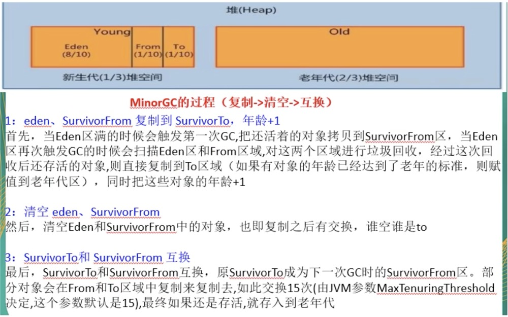

#### JAVA内存模型图

#### GC作用域
堆、方法区

<!--more-->
#### 垃圾回收算法

1. 引用计数

缺点：
- 每次对象赋值，均要维护引用计数器，且计数器本身也有消耗。
- 较难处理循环引用

JVM的实现一般不采用这种方式。

2. 复制算法

优点：整体复制，无碎片

缺点：浪费空间，耗时

<b>用于新生代</b>

3. 标记清除

优点：节约空间

缺点：产生内存碎片

<b>用于老生代</b>

4. 标记清理

<b>用于老生代</b>

### JVM垃圾回收的时候如何确定垃圾？是否知道什么是GC Roots。
1. 什么是垃圾

简单来说内存中已经不再被使用到的空间就是垃圾。

2. 如何判断一个对象是否可以被回收。
- 引用计数法
- 枚举根节点做可达性分析（根搜索路径）

所谓“GC Roots”的就是一组必须活跃的引用。

基本思路就是通过一系列名为“GC Roots”的对象作为起始点，从这个被称为GC Roots的对象开始向下搜索，如果一个对象到GC Roots没有任何引用链相连时，则说明此对象不可用。也即给定一个集合的引用作为根触发，通过引用关系遍历对象图，能被遍历到（可达的）对象就被判定为存货，没有被遍历到的就自然被判定为死亡。

#### 哪些对象可以做为GC Roots
- 虚拟机栈（栈帧中的局部变量区，也叫做局部变量表）中引用的对象。
- 方法区中的类静态属性引用的对象。
- 方法区中常量引用的对象。
- 本地房发展JNI(native方法)引用的对象。

### 你说你做过的JVM调优的参数配置，请问如何盘点JVM系统默认值

### 你平时工作用过的JVM常用基本配置参数有哪些

### 强引用，软引用，弱引用，虚引用有什么却别

### 请谈谈你对OOM的认识

### GC垃圾回收算法和垃圾收集器的关系？分别是什么？

### 怎么查看服务器默认的垃圾收集器是哪个？生产商如何配置垃圾收集器的，谈谈你对垃圾收集器的理解。

### G1垃圾收集器

### 生产环境服务器变慢，诊断思路和性能评估谈谈？

### 假如生产环境出现CPU占用过高，请谈谈你的分析思路和定位

