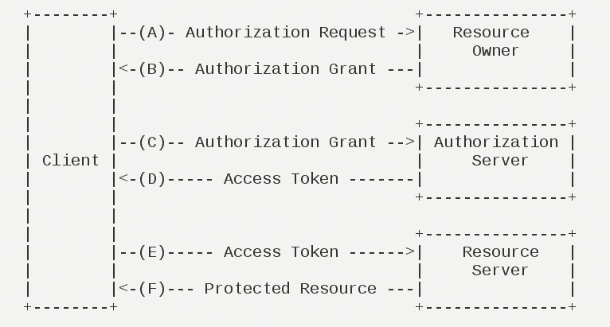

[Spring Security](https://spring.io/projects/spring-security)、[Spring OAuth2](https://spring.io/guides/tutorials/spring-boot-oauth2/)是Spring里常用的安全处理框架，Spring Security负责鉴权与授权，Spring OAuth2负责发放令牌。

[JustAuth](https://gitee.com/yadong.zhang/JustAuth)是一款非常优秀的第三方登录开源组件，可以跟前面两个搭配使用。在Spring Boot里面可以采用它的starter组件[justauth-spring-boot-starter](https://github.com/justauth/justauth-spring-boot-starter)。

只要在JustAuth里面配置好第三方平台登录需要的：appId，appKey，callback url，JustAuth可以自己处理相关请求，免去写相关逻辑代码。

<!-- more -->

OAuth2.0定了授权过程的几个参与方：
- Third-party application：第三方应用程序。

- Resource Owner：资源所有者，本文中又称"用户"（user）。

- Authorization server：认证服务器，即服务提供商专门用来处理认证的服务器。

- Resource server：资源服务器，即服务提供商存放用户生成的资源的服务器。它与认证服务器，可以是同一台服务器，也可以是不同的服务器。

举个例子，我现在要在爱奇艺网站上看电影，现在没有爱奇艺账号，想用微信登录。

那我就是*资源所有者*，爱奇艺就是*第三方用户*，微信后台就是*认证服务器*和*资源服务器*。其中资源可以理解为*我的基本账户信息*，例如昵称头像等（当然做过微信端登录的就是知道还有个openid/uionid）。


客户端：就是我们

OAuth2.0定义了4种授权模式。
- 授权码模式（authorization code）
- 简化模式（implicit）
- 密码模式（resource owner password credentials）
- 客户端模式（client credentials）

还有一种是刷新令牌，严格来说不是模式，只是OAuth2.0的一种刷新令牌的规范规范而已。当然Spring OAuth2.0也有实现。

我们见得最多的授权码模式。流程如下图

>（A）用户打开客户端以后，客户端要求用户给予授权。
>
>（B）用户同意给予客户端授权。
>
>（C）客户端使用上一步获得的授权，向认证服务器申请令牌。
>
>（D）认证服务器对客户端进行认证以后，确认无误，同意发放令牌。
>
>（E）客户端使用令牌，向资源服务器申请获取资源。
>
>（F）资源服务器确认令牌无误，同意向客户端开放资源。

在我们上面微信登录爱奇艺的例子中
(A) 用户点击微信登录，爱奇艺WEB端向爱奇艺后台，发起微信登录请求，爱奇艺后台返回一个重定向，重定向到微信授权网页（扫码页面），会携带上State值和自己的回调地址。

(B) 用户扫码之后，微信后台生成一个授权码，和刚刚收到的State值，一起附加到（A）中的回调地址后面，并且发起请求。

(C）爱奇艺后台获取到微信授权码之后，向微信后台请求access token。取到之后，然后拿着access token像微信后台请求用户信息，然后执行绑定/登录操作。

但是有2个地方需要注意：
1. 微信后台会校验(A)步骤中的回调地址，这个是申请微信登录的时候要填的，如果appid跟回调地址对不上，就无法取得授权码。
2. (C)步骤中，是要将请求中的State和自己保存的State进行比较的，这样可以防止跨站攻击。比如说从别的客户端的申请的授权码，调用这个接口，就可以判断State不一致而拒绝。

微信公众号登录，跟上述步骤又略有不同，参见我之前的文章：。

前面说了这么多，回到正题，可以看到JustAuth是针对这种全流程的OAuth2.0做的，在移动端模式下，第三方APP一般会集成对应的SDK，在SDK里面就会完成授权页，即从服务商的APP回到第三方APP的时候，就会带上ACCESS_TOKEN，第三方APP将ACCESS_TOKEN到后台，后台校验次ACCESS_TOKEN并且请求用户数据，执行绑定和注册的操作。

JustAuth将请求授权的操作定义在AuthRequest接口里面：
```java
public interface AuthRequest {
    default String authorize(String state) {
        throw new AuthException(AuthResponseStatus.NOT_IMPLEMENTED);
    }

    default AuthResponse login(AuthCallback authCallback) {
        throw new AuthException(AuthResponseStatus.NOT_IMPLEMENTED);
    }

    default AuthResponse revoke(AuthToken authToken) {
        throw new AuthException(AuthResponseStatus.NOT_IMPLEMENTED);
    }

    default AuthResponse refresh(AuthToken authToken) {
        throw new AuthException(AuthResponseStatus.NOT_IMPLEMENTED);
    }
}
```
可以看到，里面并没有一个单独的getUserInfo的操作，但是查看它的AuthDefaultRequest实现类里面
```java
public abstract class AuthDefaultRequest implements AuthRequest {
    ...

    /**
     * 使用token换取用户信息
     *
     * @param authToken token信息
     * @return 用户信息
     * @see AuthDefaultRequest#getAccessToken(AuthCallback)
     */
    protected abstract AuthUser getUserInfo(AuthToken authToken);
    ...
}
```
里面定义了一个getUserInfo方法，但是他是protected的，也就是说只有子类可以调用。可以利用反射可以调用。
```java
    private final AuthRequestFactory factory;

    @Override
    public OAuth2AccessToken login(String oauthType, AuthToken authToken) {
        AuthUser authUser = null;
        AuthDefaultRequest authRequest = (AuthDefaultRequest)factory.get(oauthType);
        Method getUserInfoMethod = ReflectUtil.getMethod(AuthDefaultRequest.class, "getUserInfo", AuthToken.class);
        try {
            getUserInfoMethod.setAccessible(true);
            authUser = (AuthUser) getUserInfoMethod.invoke(authRequest, authToken);
        } catch (IllegalAccessException | InvocationTargetException | AuthException e) {
            log.error("获取用户信息失败", e);
            return null;
        }
        //绑定账户，授权。
    }
```
ReflectUtil来自hutool工具包。
```xml
<dependency>
    <groupId>cn.hutool</groupId>
    <artifactId>hutool-core</artifactId>
    <version>5.5.1</version>
</dependency>
```

有时间整一篇，Spring OAuth2.0授权过程源码分析。

参考
- http://www.ruanyifeng.com/blog/2014/05/oauth_2_0.html
- http://www.ruanyifeng.com/blog/2019/04/oauth-grant-types.html
- https://developers.line.biz/en/docs/line-login/secure-login-process/#using-access-tokens