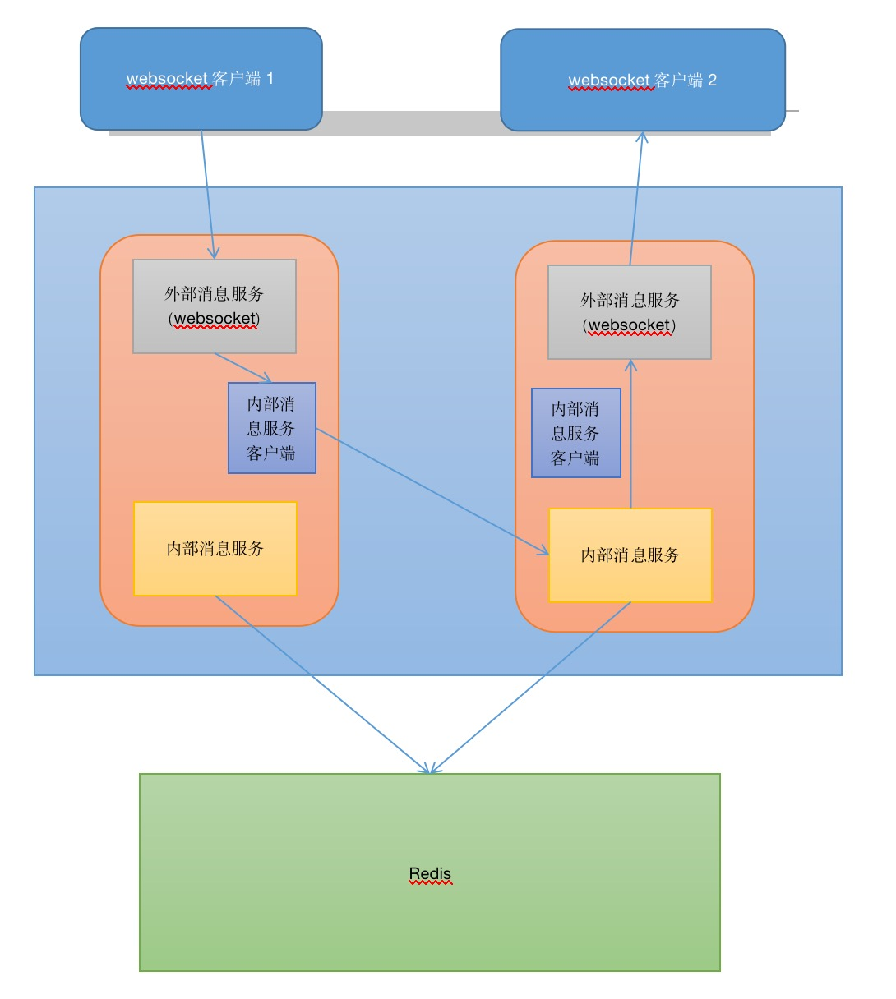
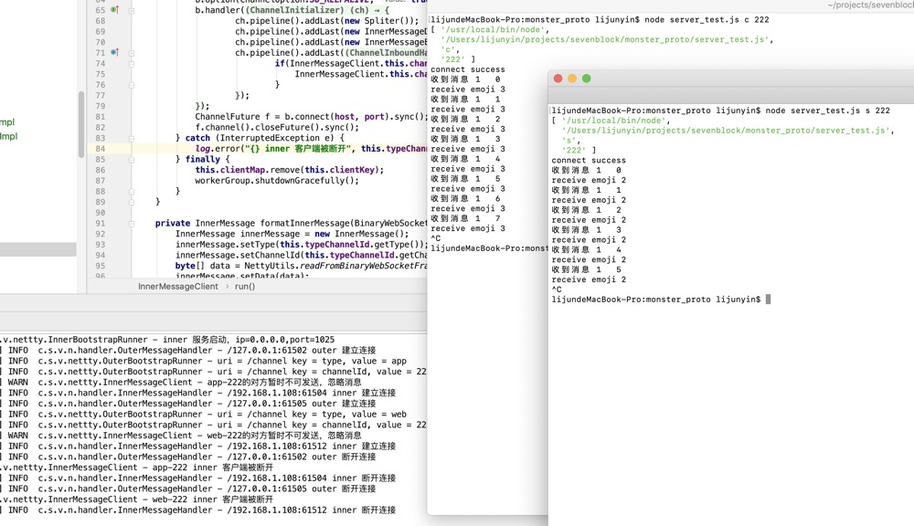

上篇blog ，实现了一个单机版的websocket点对点通信demo，

今天把它升级为集群版。
### 介绍
首先把架构画出来。


* websocket客户端连接到外部服务。。
* websocket客户端会带上Type和Channel Id两个字段，我这里业务需求是这样的，你可以把type理解为用户ID,Channel ID理解为房间ID。这俩字段组合成一个<b>用户通道ID</b>
* <b>内部服务</b>已<b>用户通道ID</b>为key，已自己的IP端口为value，注册到redis.
* 外部服务这个<b>用户通道ID</b>，推断出对端的<b>用户通道ID</b>，在redis上查找出对方内部服务的IP端口。
* 如果没有查到，表示对端未连接，否则，起一个netty客户端，与对方的内部服务进行连接。
* 对端的内部消息服务收到消息后，根据消息里的Channel Id字段找到链接到外部服务的websocket连接，并转发数据。
* 对端websocket客户端的连接过程也是一样。

下面直接上代码。

### pom.xml
```java
<dependency>
    <groupId>io.netty</groupId>
    <artifactId>netty-all</artifactId>
    <version>4.1.50.Final</version>
</dependency>
```

### application.yml
```yml
netty:
  outer:
    # 外部端口，即客户端的websocket端口
    port: 1024
    # 绑定的网卡
    ip: 0.0.0.0
    # 消息帧最大体积
    max-frame-size: 10240
    # 客户端ws端点
    path: /channel
  inner:
    # 绑定的网卡
    ip: 0.0.0.0
    # 内部端口，即集群内部件通信的端口
    port: 1025
```
### 外部netty服务（websocket服务）
外部netty服务，负责接收集群外部的websocket客户端连接。
```java
@Slf4j
@Component
public class OuterBootstrapRunner implements ApplicationListener<ContextClosedEvent>, Runnable {

    @Value("${netty.outer.ip}")
    private String ip;

    @Value("${netty.outer.port}")
    private int port;

    @Value("${netty.outer.path}")
    private String path;

    @Autowired
    private InnerMessageService innerMessageService;

    @Autowired
    private OuterMessageService outerMessageService;

    private Channel serverChannel;

    @PostConstruct
    public void startServer() {
        new Thread(this).start();
    }

    @Override
    public void run() {
        EventLoopGroup bossGroup = new NioEventLoopGroup();
        EventLoopGroup workerGroup = new NioEventLoopGroup();
        try {
            ServerBootstrap serverBootstrap = new ServerBootstrap();
            serverBootstrap.group(bossGroup, workerGroup);
            serverBootstrap.channel(NioServerSocketChannel.class);
            serverBootstrap.localAddress(new InetSocketAddress(ip, port));
            serverBootstrap.childHandler(new ChannelInitializer<SocketChannel>() {
                @Override
                protected void initChannel(SocketChannel socketChannel) throws Exception {
                    ChannelPipeline pipeline = socketChannel.pipeline();
                    pipeline.addLast(new HttpServerCodec());
                    pipeline.addLast(new ChunkedWriteHandler());
                    pipeline.addLast(new HttpObjectAggregator(65536));
                    pipeline.addLast(new ChannelInboundHandlerAdapter() {
                        @Override
                        public void channelRead(ChannelHandlerContext ctx, Object msg) throws Exception {
                            if(msg instanceof FullHttpRequest) {
                                AttributeKey<Map<String,String>> requestParam = AttributeKey.valueOf("request.params");

                                FullHttpRequest request = (FullHttpRequest) msg;
                                //http request uri: /chat?accesskey=hello
                                String uri    = request.uri();
                                String [] splittedUri = uri.split("\\?");

                                HashMap<String, String> params = new HashMap<String, String>();
                                request.setUri(splittedUri[0]);
                                if(splittedUri.length > 1){
                                    String queryString = splittedUri[1];
                                    for(String param : queryString.split("&")){
                                        String [] keyValue = param.split("=");
                                        if(keyValue.length >= 2){
                                            log.info("uri = {} key = {}, value = {}", splittedUri[0], keyValue[0], keyValue[1]);
                                            params.put(keyValue[0], keyValue[1]);
                                        }
                                    }
                                }
                                ctx.channel().attr(requestParam).set(params);
                                //将websocket客户端保存起来。
                                outerMessageService.saveInnerChannel(ctx, params.get(NettyConstants.WS_TYPE_KEY),
                                        params.get(NettyConstants.CHANNEL_ID_KEY));
                                //暴露内部服务地址。        
                                innerMessageService.exposeMyInnerUrl(ctx, params.get(NettyConstants.WS_TYPE_KEY),
                                        params.get(NettyConstants.CHANNEL_ID_KEY));
                            }
                            super.channelRead(ctx, msg);
                        }
                        @Override
                        public void channelUnregistered(ChannelHandlerContext ctx) {
                            outerMessageService.removeInnerChannel(ctx);
                            innerMessageService.removeInnerChannel(ctx);
                        }
                    });
                    pipeline.addLast(new WebSocketServerCompressionHandler());
                    pipeline.addLast(new WebSocketServerProtocolHandler(path));
                    pipeline.addLast(SpringContextUtils.getBean("outerMessageHandler", OuterMessageHandler.class));
                }
            });
            Channel channel = serverBootstrap.bind().sync().channel();
            this.serverChannel = channel;
            log.info("outer 服务启动，ip={},port={}", ip, port);
            channel.closeFuture().sync();
        } catch (InterruptedException e) {
            log.error("outer 服务被打断", e);
        } finally {
            bossGroup.shutdownGracefully();
            workerGroup.shutdownGracefully();
        }
    }

    @Override
    public void onApplicationEvent(ContextClosedEvent event) {
        if (this.serverChannel != null) {
            this.serverChannel.close();
        }
        log.info("websocket 服务停止");
    }
}
```
### 内部netty服务（普通netty服务）
内部netty服务，负责接收集群内部的消息客户端连接。
```java
@Slf4j
@Component
public class InnerBootstrapRunner implements ApplicationListener<ContextClosedEvent>, Runnable {

    @Value("${netty.inner.ip}")
    private String ip;

    @Value("${netty.inner.port}")
    private int port;

    private Channel serverChannel;

    @PostConstruct
    public void setApplicationContext() {
        new Thread(this).start();
    }

    @Override
    public void run() {

        EventLoopGroup bossGroup = new NioEventLoopGroup();
        EventLoopGroup workerGroup = new NioEventLoopGroup();
        try {
            ServerBootstrap serverBootstrap = new ServerBootstrap();
            serverBootstrap.group(bossGroup, workerGroup);
            serverBootstrap.channel(NioServerSocketChannel.class);
            serverBootstrap.localAddress(new InetSocketAddress(ip, port));
            serverBootstrap.childHandler(new ChannelInitializer<SocketChannel>() {
                @Override
                protected void initChannel(SocketChannel socketChannel) throws Exception {
                    ChannelPipeline pipeline = socketChannel.pipeline();
                    pipeline.addLast(new Spliter());
                    pipeline.addLast(new InnerMessageDecoder());
                    pipeline.addLast(new InnerMessageEncoder());
                    pipeline.addLast(SpringContextUtils.getBean("innerMessageHandler", InnerMessageHandler.class));
                }
            });

            Channel channel = serverBootstrap.bind().sync().channel();
            this.serverChannel = channel;
            log.info("inner 服务启动，ip={},port={}", ip, port);
            channel.closeFuture().sync();
        } catch (InterruptedException e) {
          log.error("inner 服务被打断", e);
        } finally {
            bossGroup.shutdownGracefully();
            workerGroup.shutdownGracefully();
        }
    }

    @Override
    public void onApplicationEvent(ContextClosedEvent event) {
        if (this.serverChannel != null) {
            this.serverChannel.close();
        }
        log.info("netty 服务停止");
    }
}
```

### 外部消息处理类
读取外部的websocket数据，并转交给内部消息服务类处理。
```java
@Slf4j
@ChannelHandler.Sharable
@Component
public class OuterMessageHandler extends SimpleChannelInboundHandler<BinaryWebSocketFrame> {
    @Autowired
    private InnerMessageService innerMessageService;

    @Override
    protected void channelRead0(ChannelHandlerContext ctx, BinaryWebSocketFrame msg) {
        TypeChannelId typeChannelId = NettyUtils.getTypeChannelId(ctx);
        //转发到内部消息服务
        this.innerMessageService.onOuterMessage(ctx, typeChannelId, msg);
    }

    @Override
    public void channelActive(ChannelHandlerContext ctx) throws Exception {
        log.info("{} outer 建立连接", ctx.channel().remoteAddress());
    }

    @Override
    public void channelInactive(ChannelHandlerContext ctx) {
        log.info("{} outer 断开连接", ctx.channel().remoteAddress());
    }

    @Override
    public void exceptionCaught(ChannelHandlerContext ctx, Throwable cause) {
        cause.printStackTrace();
    }
}
```
### 内部消息服务类
将收到的外部消息，通过内部消息客户端连接到对方的内部消息服务，并转发出去。如果对方没有注册，即忽略此消息。
```java
@Slf4j
@Service
public class InnerMessageServiceImpl implements InnerMessageService {
    private static Map<String, InnerMessageClient> clientMap = new ConcurrentHashMap<>();

    @Value("${netty.inner.ip}")
    private String ip;

    @Value("${netty.inner.port}")
    private int port;

    @Autowired
    private StringRedisTemplate stringRedisTemplate;

    private void runNettyClientIfRemoteRegistered(TypeChannelId typeChannelId) {
        String clientKey = typeChannelId.toString();
        InnerMessageClient client = clientMap.get(clientKey);
        if(client != null) {
            //快速返回
            return;
        }
        String remoteUrlKey = NettyUtils.formatRemoteServerUrl(typeChannelId);
        String remoteUrl = stringRedisTemplate.opsForValue().get(remoteUrlKey);
        if(!StringUtils.isEmpty(remoteUrl)) {
            String[] segments = remoteUrl.split(":");
            if(segments.length != 2) {
                log.error("对端存储的url无效，关闭连接。");
                return;
            }

            String ip = segments[0];
            int port = Integer.valueOf(segments[1]);
            clientMap.putIfAbsent(clientKey, new InnerMessageClient(clientMap, clientKey, typeChannelId, ip, port));
            clientMap.get(clientKey).start();
        }
    }

    @Override
    public void onOuterMessage(ChannelHandlerContext ctx, TypeChannelId typeChannelId, BinaryWebSocketFrame frame) {
        runNettyClientIfRemoteRegistered(typeChannelId);
        String key = typeChannelId.toString();
        InnerMessageClient client = clientMap.get(key);
        if(client != null) {
            client.sendMessage(frame);
        } else {
            log.warn("{}的对端尚未连接，忽略收到的数据",typeChannelId.toString());
        }
    }

    @Override
    public void exposeMyInnerUrl(ChannelHandlerContext ctx, String type, String channelId) {
        TypeChannelId typeChannelId = new TypeChannelId(type, channelId);
        String myUrlKey = NettyUtils.formatMyServerUrl(typeChannelId);
        ValueOperations<String, String> ops = stringRedisTemplate.opsForValue();
        if(ops.get(myUrlKey) != null) {
            return;
        }
        try {
            InetAddress address = null;
            address = InetAddress.getLocalHost();
            String ip = address.getHostAddress();
            String url = String.format("%s:%s", ip, port);
            Boolean success = ops.setIfAbsent(myUrlKey, url, Duration.ofDays(1));
            if(success == null || !success) {
                log.error("该channel已存在，关闭连接。");
                ctx.channel().close();
            }
        } catch (UnknownHostException e) {
            log.error("无法获取本机IP，关闭连接。", e);
            ctx.channel().close();
        }
    }

    @Override
    public void removeInnerChannel(ChannelHandlerContext ctx) {
        TypeChannelId typeChannelId = NettyUtils.getTypeChannelId(ctx);
        String clientKey = typeChannelId.toString();
        InnerMessageClient client = clientMap.get(clientKey);
        if(client == null) {
            //快速返回
            return;
        }
        client.interrupt();
    }
}
```

### 内部消息客户端（netty客户端）
将数据封装好，发送出去。
```java
@Slf4j
public class InnerMessageClient extends Thread {
    private Map<String, InnerMessageClient> clientMap;
    private String clientKey;
    private TypeChannelId typeChannelId;
    private String host;
    private int port;
    private AtomicBoolean running = new AtomicBoolean(false);
    private Channel channel;

    public InnerMessageClient(Map<String, InnerMessageClient> clientMap, String clientKey,
                              TypeChannelId typeChannelId, String host, int port) {
        this.clientMap = clientMap;
        this.clientKey = clientKey;
        this.typeChannelId = typeChannelId;
        this.host  = host;
        this.port = port;
    }

    public boolean isRunning() {
        return running.get();
    }

    @Override
    public void run() {
        boolean v = running.getAndSet(true);
        if(v) {
            return;
        }

        EventLoopGroup workerGroup = new NioEventLoopGroup();
        try {
            Bootstrap b = new Bootstrap();
            b.group(workerGroup);
            b.channel(NioSocketChannel.class);
            b.option(ChannelOption.SO_KEEPALIVE, true);
            b.handler(new ChannelInitializer<SocketChannel>() {
                @Override
                public void initChannel(SocketChannel ch) throws Exception {
                    ch.pipeline().addLast(new Spliter());
                    ch.pipeline().addLast(new InnerMessageDecoder());
                    ch.pipeline().addLast(new InnerMessageEncoder());
                    ch.pipeline().addLast(new ChannelInboundHandlerAdapter() {
                        @Override
                        public void channelActive(ChannelHandlerContext ctx) throws Exception {
                            if(InnerMessageClient.this.channel == null) {
                                InnerMessageClient.this.channel = ctx.channel();
                            }
                        }
                    });
                }
            });
            ChannelFuture f = b.connect(host, port).sync();
            f.channel().closeFuture().sync();
        } catch (InterruptedException e) {
            log.error("{} inner 客户端被断开", this.typeChannelId.toString());
        } finally {
            this.clientMap.remove(this.clientKey);
            workerGroup.shutdownGracefully();
        }
    }

    private InnerMessage formatInnerMessage(BinaryWebSocketFrame frame) {
        InnerMessage innerMessage = new InnerMessage();
        innerMessage.setType(this.typeChannelId.getType());
        innerMessage.setChannelId(this.typeChannelId.getChannelId());
        byte[] data = NettyUtils.readFromBinaryWebSocketFrame(frame);
        innerMessage.setData(data);

        return innerMessage;
    }

    public void sendMessage(BinaryWebSocketFrame frame) {
        if(this.channel != null && this.channel.isWritable()) {
            InnerMessage innerMessage = formatInnerMessage(frame);
            this.channel.writeAndFlush(innerMessage).addListener(
                new GenericFutureListener<Future<? super Void>>() {
                    @Override
                    public void operationComplete(Future<? super Void> future) throws Exception {
                        if(!future.isSuccess()) {
                            log.info("发送inner message失败 {}", future.cause());
                        }

                    }
            });
        } else {
            log.warn("{}的对方暂时不可发送，忽略消息", typeChannelId.toString());
        }
    }
}
```
### 外部消息服务类
外部消息服务类，保存了链接到本机的websocket链接，收到内部消息之后，通过websocket发出去。
```java
@Slf4j
@Service
public class OuterMessageServiceImpl implements OuterMessageService {
    private static Map<String, Channel> appChannel = new ConcurrentHashMap<>();
    private static Map<String, Channel> webChannel = new ConcurrentHashMap<>();

    @Override
    public void onInnerMessage(InnerMessage message) {
        byte[] data = message.getData();
        ByteBuf buf = Unpooled.buffer(data.length);
        buf.writeBytes(data);
        String channelId = message.getChannelId();
        switch (message.getType()) {
            case NettyConstants.WS_TYPE_WEB:
                Channel web = appChannel.getOrDefault(channelId,null);
                if(web != null) {
                    web.writeAndFlush(new BinaryWebSocketFrame(buf));
                }
                break;
            case NettyConstants.WS_TYPE_APP:
                Channel app = webChannel.getOrDefault(channelId,null);
                if(app != null) {
                    app.writeAndFlush(new BinaryWebSocketFrame(buf));
                }
                break;
        }
    }

    @Override
    public void saveInnerChannel(ChannelHandlerContext ctx, String type, String channelId) {
        switch (type) {
            case NettyConstants.WS_TYPE_APP:
                appChannel.putIfAbsent(channelId, ctx.channel());
                break;
            case NettyConstants.WS_TYPE_WEB:
                webChannel.putIfAbsent(channelId, ctx.channel());
                break;
            default:
                log.error("无效的通道类型：{}", type);
        }
    }

    @Override
    public void removeOuterChannel(ChannelHandlerContext ctx) {
        TypeChannelId typeChannelId = NettyUtils.getTypeChannelId(ctx);
        String channelId = typeChannelId.getChannelId();
        switch (typeChannelId.getType()) {
            case NettyConstants.WS_TYPE_APP:
                appChannel.remove(channelId);
                break;
            case NettyConstants.WS_TYPE_WEB:
                webChannel.remove(channelId);
                break;
        }
    }
}

```

### 内部消息处理类
读取内部netty服务的消息，交给外部消息服务类。
```java
@Slf4j
@ChannelHandler.Sharable
@Component
public class InnerMessageHandler extends SimpleChannelInboundHandler<InnerMessage> {

    @Autowired
    private OuterMessageService outerMessageService;

    @Override
    protected void channelRead0(ChannelHandlerContext ctx, InnerMessage msg) {
        outerMessageService.onInnerMessage(msg);
    }

    @Override
    public void channelInactive(ChannelHandlerContext ctx) {
        log.info("{} inner 断开连接", ctx.channel().remoteAddress());
    }

    @Override
    public void channelActive(ChannelHandlerContext ctx) throws Exception {
        log.info("{} inner 建立连接", ctx.channel().remoteAddress());
    }

    @Override
    public void exceptionCaught(ChannelHandlerContext ctx, Throwable cause) {
        cause.printStackTrace();
    }
}
```

### 内部消息编码器
```java
public class InnerMessageEncoder extends MessageToByteEncoder<InnerMessage> {
    @Override
    protected void encode(ChannelHandlerContext channelHandlerContext,
                          InnerMessage message, ByteBuf out) throws Exception {
        int len = calcLengthOf(message);
        out.writeInt(len);
        out.writeByte(NettyUtils.typeToByte(message.getType()));
        out.writeInt(message.getChannelId().length());
        out.writeBytes(message.getChannelId().getBytes(NettyConstants.CHARSET));
        out.writeInt(message.getData().length);
        out.writeBytes(message.getData());
    }

    private int calcLengthOf(InnerMessage message) {
        //1字节type + 4字节channel id + channel id长度 + 4字节数据长度 + 数据长度
        return 1 + 4 + message.getChannelId().length() + 4 + message.getData().length;
    }
}
```

### 内部消息解码器
```java
public class InnerMessageDecoder extends ByteToMessageDecoder {
    @Override
    protected void decode(ChannelHandlerContext channelHandlerContext,
                          ByteBuf in, List<Object> out) throws Exception {
        Object object = decode(in);
        if (object != null) {
            out.add(object);
        }
    }

    private Object decode(ByteBuf in) {
        InnerMessage innerMessage = new InnerMessage();

        byte typeByte = in.readByte();
        String type = NettyUtils.byte2Type(typeByte);
        innerMessage.setType(type);

        int channelIdLen = in.readInt();
        byte[] channelIdBytes = new byte[channelIdLen];
        in.readBytes(channelIdBytes);
        innerMessage.setChannelId(new String(channelIdBytes, NettyConstants.CHARSET));

        int dataLen = in.readInt();
        byte[] dataBytes = new byte[dataLen];
        in.readBytes(dataBytes);
        innerMessage.setData(dataBytes);

        return innerMessage;
    }
}
```
### 分包器
```java
public class Spliter extends LengthFieldBasedFrameDecoder {
    private static final int MAX_LENGTH = Integer.MAX_VALUE;

    private static final int LENGTH_FIELD_OFFSET = 0;

    private static final int LENGTH_FIELD_LENGTH = 4;

    public Spliter() {
        super(MAX_LENGTH, LENGTH_FIELD_OFFSET, LENGTH_FIELD_LENGTH, 0, LENGTH_FIELD_LENGTH);
    }
}
```

### 内部消息model
```java
@Data
public class InnerMessage {
    private String type;
    private String channelId;
    private byte[] data;
}
```

### 类型通道model
```java
@Data
@AllArgsConstructor
public class TypeChannelId {
    private String type;
    private String channelId;

    @Override
    public String toString() {
        return String.format(Locale.ENGLISH, "%s-%s", type, channelId);
    }
}
```

### 常量
```java
@Slf4j
public final class NettyConstants {

    /**
     * websocket连接时的参数名，表示websocket客户端类型。
     */
    public static final String WS_TYPE_KEY = "type";

    /**
     * websocket客户端来自app，不需要鉴权。
     */
    public static final String WS_TYPE_APP = "app";

    /**
     * websocket客户端来自h5，不需要鉴权。
     */
    public static final String WS_TYPE_WEB = "web";

    /**
     * websocket连接时的参数名，表示某个通道。
     * 通道由APP端请求后台返回的随机数（需要鉴权），无法枚举。
     */
    public static final String CHANNEL_ID_KEY = "channelId";

    /**
     * channel id的正则
     */
    public static final String CHANNEL_ID_PATTERN = "^\\w{32}$";

    /**
     * 流数据编码类型
     */
    public static final Charset CHARSET = Charset.forName("UTF-8");

}
```

### 测试代码
```javascript
let WebSocket = require( 'ws' );
let GameMessage =  require("./GameMsg");

console.log(process.argv);
let type = process.argv[2];
let channelId = process.argv[3];
var ws;
let isClient = false;
if(type === 'c') {
  	isClient = true;
    ws = new WebSocket(`ws://localhost:1024/channel?type=web&channelId=${channelId}`);
} else {
    ws = new WebSocket(`ws://localhost:1024/channel?type=app&channelId=${channelId}`);
}
function sendMessage() {
  let id = isClient ? 2 : 3;
  let emoji = GameMessage.game_msg.Emoji.create({emojiId:id});
	let msg = GameMessage.game_msg.Msg.create({cmd:GameMessage.game_msg.CMD.EMOJI, emoji:emoji});
  ws.send(GameMessage.game_msg.Msg.encode(msg).finish());
}
ws.onopen = function(){
    console.log("connect success");
		setInterval(sendMessage, 10000);
}
ws.onerror = function(e) {
		console.error("链接出错",e);
}
ws.onclose = function(e) {
		console.error("链接closed",e);

}
let i = 0;
ws.onmessage = function(evt){
  	let message = evt.data
    let msg = GameMessage.game_msg.Msg.decode(message);
		console.log("收到消息", msg.cmd, " ", i++);
    switch(msg.cmd) {
        case GameMessage.game_msg.CMD.EMOJI:
            console.log("receive emoji", msg.emoji.emojiId);
            break;
    }
}
```
### 测试截图


### 结论
这种netty转发的方式，比之前用kafka方式实现的率高很多（  ），消息收发很流畅，没有任何卡顿情况。

### 参考
https://github.com/lightningMan/simple-message-push