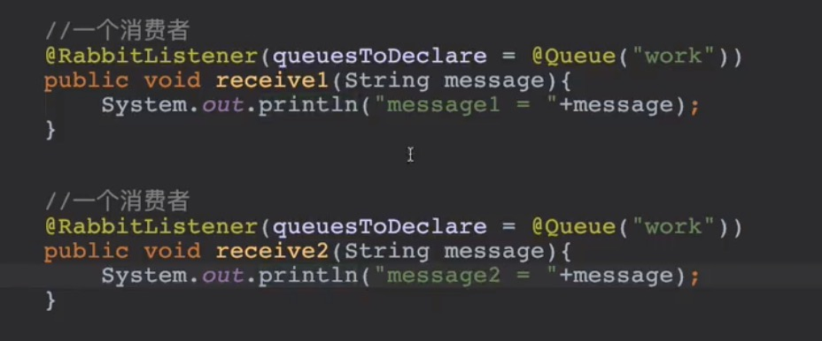
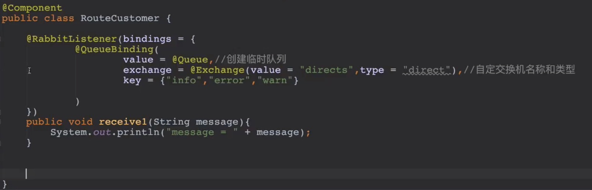
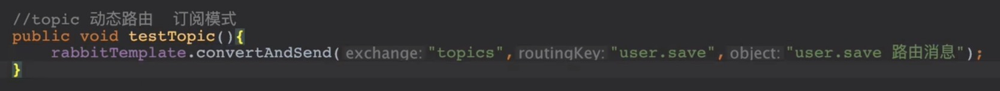

消息队列的场景
- 异步处理
- 应用解耦
- 流量削峰

### rabbitmq里的概念
#### 虚拟机
1 物理机 -> N 虚拟机
起到业务隔离的作用，不同业务之间可以用不同的虚拟机。
#### 交换机 
1 虚拟机 -> N 交换机
起到消息分发的作用，是消息的路由，消息也可以不经过交换机，直接追加到队列，。
#### 消息队列
1 交换机 -> N 消息队列
存放消息的容器。

<!-- more -->
### 工作模型

#### HelloWord

1. 生产者申明队列
```java
/**
 * 参数1：队列名称
 * 参数2：是否持久化
 * 参数3：是否独占队列，代表队列是否可以被其他连接所使用
 * 参数4：是否在消费完成后自动删除队列
 * 参数5：附加参数
 */
channel.queueDeclare("hello", false, false, false, null);
```
2. 发送消息
```java
channel.basicPublish("", "hello", null, "hello world".getBytes());
```

3. 消费者声明队列
```java
channel.queueDeclare("hello", false, false, false, null);
```

4. 生产者消费
```java
channel.basicConsume("hello", true, new DefaultConsumer(channel) {
    @Override
    public void handleDelivery(String consumerTag, Envelope envelope, AMQP.BasicProperties properties, byte[] body) throws IOException {
        super.handleDelivery(consumerTag, envelope, properties, body);
        System.out.println("收到消息: "+ new String(body));
    }
});
```

#### 能者多劳

消息确认机制
- 自动确认 收到消息以后，自动发送确认，不推荐。
- **手动确认** 业务逻辑处理完后，手动发送确认。

QPS 
每次获取的消息数量，在手动确认模式下，最好为设置为1，否则业务中途宕机的话会导致大量消息无法得到确认。

#### WorkQueue模式
跟HelloWorld模式下，多个消费者端。

#### Fanout模型（广播）
广播模式下，一个交换机上的所有队列都会收到生产者的消息。举个例子，现在有个用户注册的消息，要发到邮件模块去发送邮件，也要发到短信模块去发送短信。
1. 生产者申明交换机
```java
//参数1 交换机名称
//参数2 固定为"fanout"
Channel.exchangeDeclare("orders", "fanout");
```
2. 发送消息到交换机
```java
//参数1 交换机名称
//参数2 routingKey名称，fanout模式下不填
//参数3 消息额外属性
//参数4 消息内容
Channel.basicPublish("orders", "", null, "message".getBytes());
```

3. 消费者声明交换机
```java
Channel.exchangeDeclare("orders", "fanout");
```

4. 消费者创建临时队列
```java
String queueName = channel.queueDeclare().getQueue();
```
5. 绑定交换机和队列
```java
//参数1 第4步创建的临时队列名称
//参数2 交换机名称
//参数3 routeingKey 不填
channel.queueBind(queueName, "orders", "");
```

#### Routing模型（多播）
Routing模型是Fanout模型的增强，可以选择某些队列分进行转发，转发的规则是根据routingKey匹配的。比如日志，有些模块关心error级别的日志，有些模块关心info级别的日志，可以进行交换机根据routingKey转发到不同的队列。

消息生产者发送消息时，也会指定routeKey。
1. 生产者申明交换机
```java
//第一个参数 交换机名称
//第二个参数 固定为direct，否则routingKey无效。
Channel.exchangeDeclare("logs", "direct");
```
2. 生产者发布消息
```java
//参数1 交换机名称
//参数2 routingKey名称，根据此值匹配路由
//参数3 消息额外属性
//参数4 消息内容
Channel.basicPublish("logs", "warning", null, "sth warning".getBytes());
```

3. 消费者声明交换机
```java
Channel.exchangeDeclare("logs", "direct");
```

4. 消费者创建临时队列
```java
String queueName = channel.queueDeclare().getQueue();
```
5. 绑定交换机和队列
```java
//参数1 第4步创建的临时队列名称
//参数2 交换机名称
//参数3 routeKey
channel.queueBind(queueName, "orders", "warning");
//可以绑定多条
channel.queueBind(queueName, "orders", "error");
channel.queueBind(queueName, "orders", "info");
```

#### Topic模型
Topic模型又是Routing模型的增强，针对routingKey多了一个通配符匹配操作，避免routeKey大爆炸的问题。

通配符
- '*'(start) 匹配不多不少恰好一个词
如audit.* 只能匹配audit.irs
- ‘#’(hash) 匹配一个或多个词
如audit.# 能匹配audit.irs.corporate或者audit.irs等。

1. 生产者申明交换机
```java
//参数1 交换机名称
//参数2 固定为"topic"
channel.exchangeDeclare("user_action", "topic");
```
2. 生产者发布消息
```java
//参数1 交换机名称
//参数2 routingKey
//参数3 消息额外属性
//参数4 消息内容
channel.basicPublish("user_action", "user.register", null);
```

3. 消费者声明交换机
```java
Channel.exchangeDeclare("user_action", "topic");
```

4. 消费者创建临时队列
```java
String queueName = channel.queueDeclare().getQueue();
```
5. 绑定交换机和队列
```java
//参数1 第4步创建的临时队列名称
//参数2 交换机名称
//参数3 routeKey 
channel.queueBind(queueName, "user_action", "user.*");
```
### RabbitMQ和SpringBoot

#### 依赖
```xml
<dependency>
    <groupId>org.springframwork.boot</groupId>
    <artifactId>spring-boot-starter-amqp</artifactId>
</dependency>
```
#### application.yml配置
```yml
spring:
  rabbitmq:
    host: 10.15.0.9
    port: 5672
    username: usernmae
    password: password
    virtual-host: / 
```

#### 注入
```java
@AutoWired
private RabbitTemplate rabbitTemplate
```

#### 工作模式

0. HelloWord

生产者

消费者


1. WorkQueue模型

生产者

消费者



2. Fanout模型

生产者

消费者


3. Routing模型

生产者

消费者


4. Topic模型

生产者

消费者


### RabbitMQ集群

#### 普通模式（主备模式）
并不能做到高可用，从节点仅同步交换机信息和队列元数据，不同步队列消息。


#### 镜像模式
会同步队列消息， 可以做到故障转移。


搭建方式，在普通模式搭建好的基础上，做相应配置即可。

1. 查看当前策略
```bash
rabbitmqctl list_policies
```
2. 添加策略
```bash
rabbitmqctl set_policy ha-all '^hello' '{"ha-mode":"all", "ha-sync-mode":"automatic"}'
```
说明：策略正则表达式“^”表示所有匹配所有队列名称，^hello匹配hello开头队列。

命令解析
```bash
rabbitmqctl set_policy [-p <vhost>] [--priority <priority>] [--apply-to <apply-to>] <name> <parttern> <definetion> 
```
-p Vhost: 可选参数，针对指定vhost下的queue进行设置。
Name: policy的名称。
Pattern: queue的匹配模式(正则表达式)
Definition: 镜像定义，包括三个部分ha-mode, ha-params, ha-sync-mode
    ha-mode：指明镜像队列的模式，有效值为: all/exactly/nodes
        all: 表示在集群中所有的节点上进行镜像
        exactly: 表示在指定个数的节点上进行镜像，节点的个数有ha-params指定
        nodes: 表示在指定的节点上进行镜像，节点名称通过ha-params指定
    ha-params: ha-mode模式需要用到的参数。
    ha-sync-mode: 进行队列中消息的同步方式，有效值为automatic和manual，一般填automatic自动同步。
    priority: 可选参数，policy的优先级。    


3. 删除策略
```bash
rabbitmqctl clear_policy <name>
```
