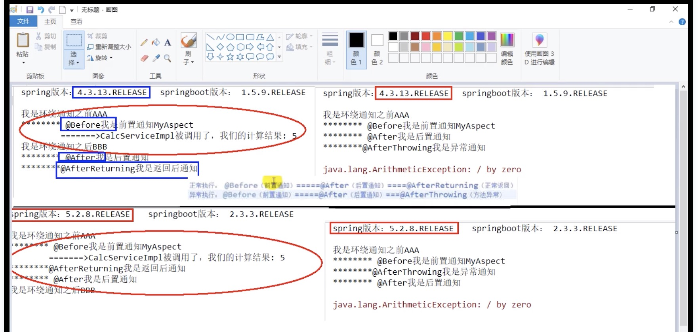
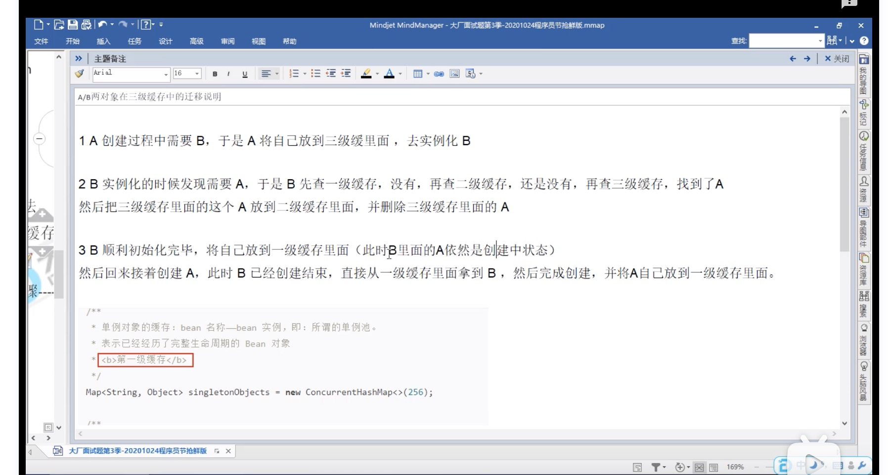

### Spring Boot的AOP调用顺序
Spring在4和5，针对正常情况和异常情况下的AOP作了调整，如图：



来源：[尚硅谷2020最新版Java面试题第三季（java大厂面试题，周阳主讲）](https://www.bilibili.com/video/BV1Hy4y1B78T?p=31)

### Spring Boot循环依赖问题
JavaSE的构造方法相互引用会带来循环依赖问题，相当于Spring Boot的Bean创建模式为prototype，改为singleton可解决循环依赖问题。

### Spring Boot三级缓存四大方法创建单例Bean过程

四大方法：getSinglton, doCreateBean, populateBean, addSingleton。

三级缓存：singletonObjects, earlySingletonObjects, singletonFactories。



来源：[尚硅谷2020最新版Java面试题第三季（java大厂面试题，周阳主讲）](https://www.bilibili.com/video/BV1Hy4y1B78T?p=39)

### synchronized和ReentrantLock的区别。

### synchronized 
synchonized是隐式锁，可以修饰方法，或者代码块。
```java
synchronized private func() {

}
```
也可以配合wait,notify。
```java
Object obj = new Object;
synchornized(obj) {
    ...
    obj.wait();这里会释放锁并等待，直到收到obj.notify。
    ..
}
```

#### ReentrantLock
ReentrantLock是显式锁。

相当于C的互斥锁
```java
Lock locker = new ReentrantLock();
locker.lock();
try {
    ...
} finally {
    locker.unlock();
}
```

也可以调用trylock，相当于C的条件锁。
```java
Lock locker = new ReentrantLock();
if(locker.trylock(1L， TimeUnit.SECOND)) {
    try {
        locker.lock();
        ...
    } finally {
        locker.unlock();
    }
} else {
    //失败
}
```
总的来说，ReentrantLock更加灵活点。

### redis分布式锁的传统解决方案
#### 加锁
setnx，即：setIfAbsent(key, value, time, timeunit);
#### 解锁
- redis 事务
- redis rua脚本

这种解锁方案有两种问题：
- 业务代码的时间长度超出锁过期时间，导致缓存续期问题。
- redis集群模式下，主机未同步锁就先宕机，从机没有同步到锁的问题。
因此引入了redisson

### redisson
加解锁的正确姿势。
```java
RLock locker = redisson.getLock(REDIS_LOCK);
locker.lock();
try {
    //业务代码
} catch() {
    if(lock.isLocked() && lock.isHeldByCurrentThread()) {
        lock.unlock();
    }
}
```

### redis内存限制
#### 查看

- 文件查看
redis.conf配置文件，里面有个maxmemory（单位是字节），如果没有配置，64位系统不限制大小，32系统限制3GB，一般在生产中设置为最大物理内存的3/4

- 命令行查看 redis-cli
```
config get maxmemory
```
### 设置
- 修改配置文件

- 命令行
```
config set maxmemory [xxx]
```
或者
```
info memory
```

### redis内存打满了会怎么样？
会报OOM


### redis的key过期删除策略

- 定时删除 以时间换空间，对CPU不友好。
- 惰性删除 到期不删除，下次使用的时候发现过期再删除，对内存不友好。
- 定期删除 每隔一段时间执行删除操作，但是限制删除执行操作的时长。需要选择被删除的key，因此引入内存淘汰策略。

### redis的内存淘汰策略

- noeviction 不驱逐任何key。
- allkey-lru 对所有key使用lru算法进行删除。（生产最常用）
- volatile-lru 对所有设置了过期时间的key使用lru算法进行删除。
- allkeys-random 对所有key进行随机删除。
- volatile-random 对所有设置了过期时间的key进行随机删除。
- volatile-ttl 删除马上过期的key。
- allkey-lfu 对所有key进行lfu算法进行删除。
- volatile-lfr 对所有设置了过期时间的key进行lfu算法进行删除。

算法解释
- LRU Least Recently Used
- LFU Least Frequently Used

设置内存淘汰策略的方式
- 配置文件
```
maxmemory-policy allkeys-lru
```
- 命令行 
```
config set maxmemory-policy allkey-lru
```