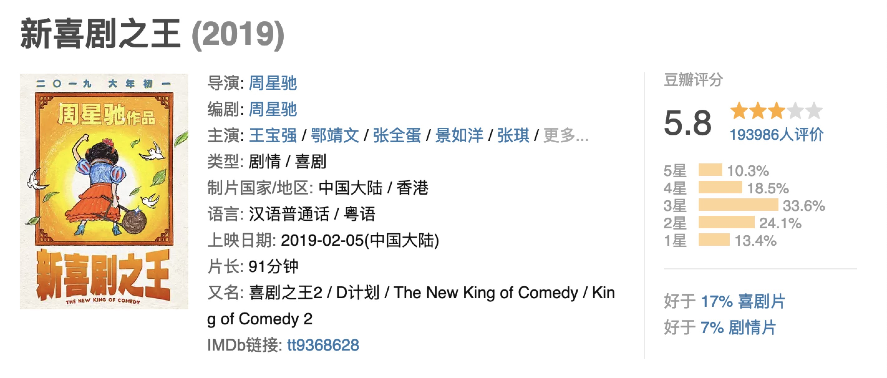
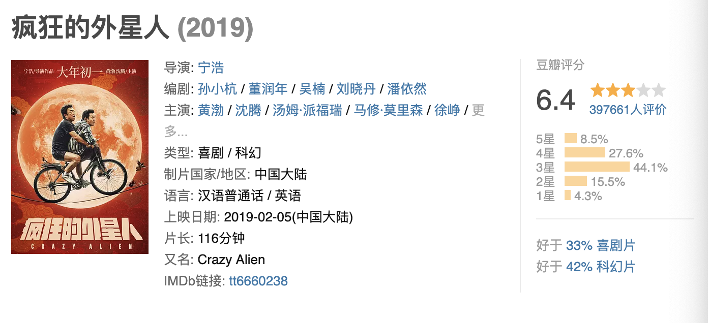

今天下午在家连着看了两部电影《新喜剧之王》、《疯狂的外星人》，都非常好看，给五颗星。

可惜这么好看的两部电影，并不被某些精英人士买账。在某瓣上，评分分别是
<!--more-->

某乎上网友的评价，一堆人在教周星驰导怎么选角，怎么导戏。还有一堆人在教宁浩导演怎么拍一部'好莱坞'式的科幻大片。

周星驰的电影上映时都会低估，如同当年的《大话西游》、《功夫》、《西游降魔篇》，当时被人吐槽的最严重的电影，后来都成了经典。<b>周星驰的作品，往往是超前于电影上映的时代的。</b>《新喜剧之王》讲了一个全新的、关于自我的故事，正如如梦在电影里说"只管做自己，不要管别人怎么讲"。周导都改变了，你们还在指望看另一部《喜剧之王》？

《疯狂的外星人》对霉国人极尽讽刺，让某些精英人士非常不爽，这是民族主义的自嗨？很明显不是，这是一个鄙视链的问题，中国人训练猴子，霉国人鄙视中国人，外星人不鸟霉国人，等到外星人成了猴子，就得靠我们的酒文化了，民族的不但是世界的，而且可以是宇宙的，这完全是宁导在实践习大大制度自信文化自信嘛。